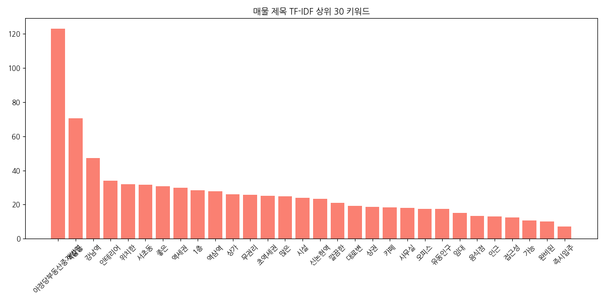
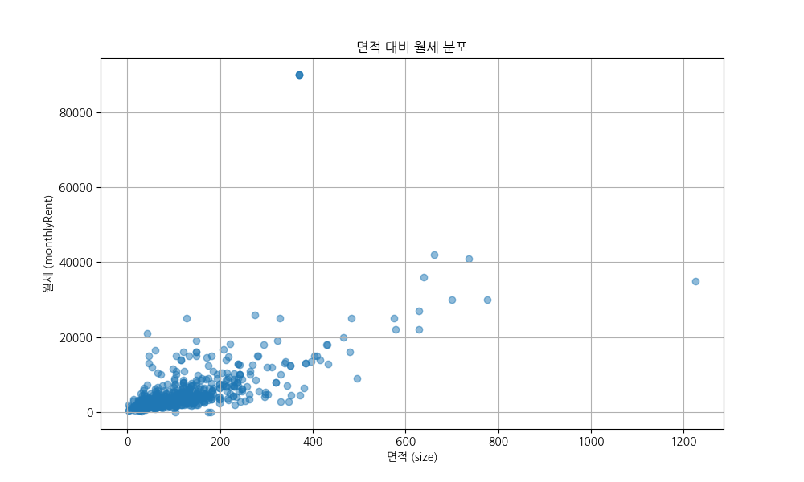
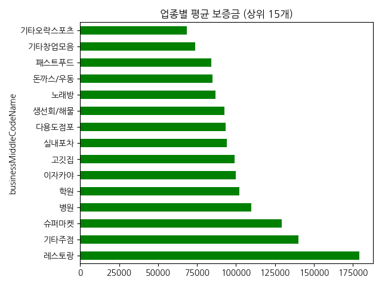
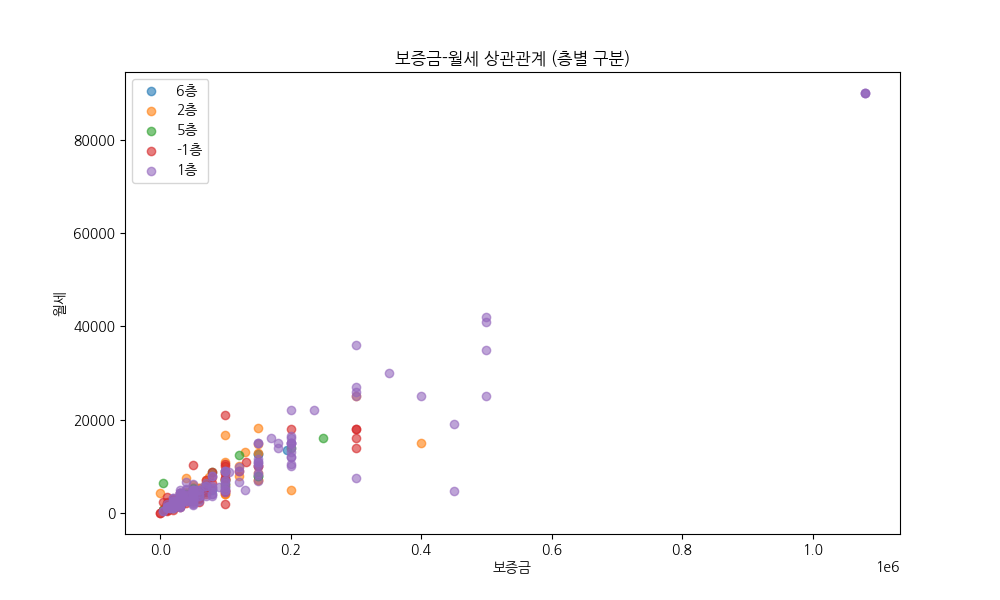
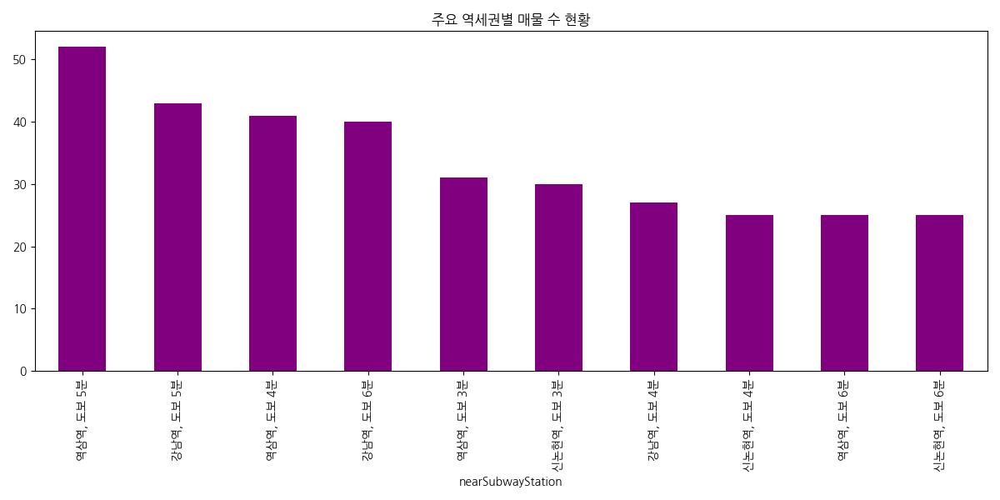
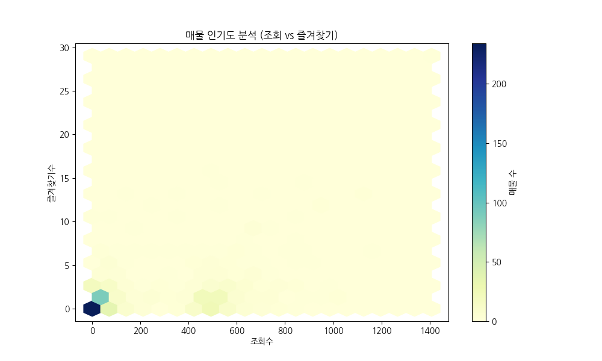
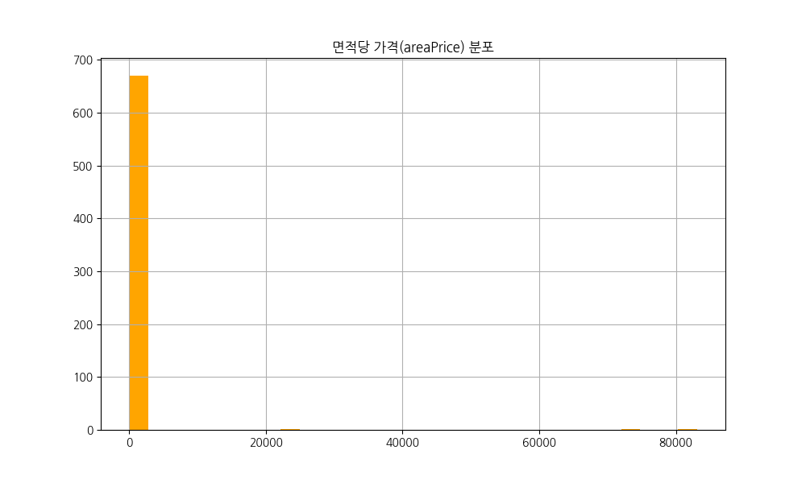

# 🎯 부동산 매물 데이터 EDA 보고서
### 강남/서초 상권 데이터 심층 분석 리포트

  

    <h2 style="color: #E8FF3B;">Core Analysis</h2>
    
20년 경력 데이터 사이언티스트가 분석한 숫자 너머의 시장 심리와 비즈니스 전략

    
강남 상권은 대한민국에서 가장 역동적이고 복잡한 곳입니다. 이번 분석이 여러분의 의사결정에 강력한 데이터 기반의 이정표가 되기를 바랍니다.

  

  

    
Total Samples

    
673

  

  

    
Region

    
강남/서초

  

---

# 📋 Slide 2: 데이터 개요 및 하이라이트

  

    
평균 보증금

    
6,895만

    
입지 간 격차 매우 큼

  

  

    
평균 월세

    
534만

    
고정비 부담 높은 편

  

  

    <h2>📍 주요 위치 스냅샷</h2>
    
역삼, 강남, 신논현 초역세권 테헤란로 핵심 축 집중 분석

    
핵심 입지와 이면 도로 입지 간의 위계가 철저히 나뉘어 있음을 시사합니다.

  

---

# 📊 Slide 3: 보증금 및 월세 양극화

  

    
Top 10% 보증금

    
1.5억+

    
Top 10% 월세

    
1,000만+

  

  

    
💡 비즈니스 통찰

    
단순 판매를 넘어 브랜드 가치를 증명하는 <b>'플래그십 스토어'</b> 요충지

  

  

    
Strategy

    
목적에 따른 타겟팅 필요:  브랜드 홍보 vs 실질 이익

  

---

# 📊 Slide 4: 면적 및 관리비 특성

  

    
면적 중앙값

    
102㎡

    
약 30평 규모

  

  

    <h2>🏢 소규모 최적화</h2>
    
IT, 뷰티 등 고부가가치 업종에 최적화된 집약적 공간 구조

  

  

    
평균 관리비

    
60만 원대

    
월세의 10~15% 수준. 실질 현금 흐름 분석 시 필수 고려 사항

  

---

# 🏗️ Slide 5: 업종 및 시장 구조

  

    
🏢

    
공간의 유연성

    
'기타창업모음', '다용도점포' 등 트렌드 민감 업종 대다수

  

  

    
임대 비율

    
99%

    
안정성

  

  

    
오프라인 공간이 '판매'에서  '체험 및 서비스' 중심으로 재편

  

---

# 🔍 Slide 6: 키워드 분석 (TF-IDF)

  

    
  

  

    
Keywords

    
#무권리 #역세권 #인테리어완비

  

  

    
CapEx 절감을 위한 실속형 수요 집중

  

---

# 📈 Slide 7: [시각화] 면적 대비 월세 상관관계

  

    
  

  

    
💡

    
입지 분석

    
면적 대비 고효율 <b>'골든 존'</b> 매물 존재

    
면적의 경제보다 '입지의 경제'가 압도적으로 작용하는 시장입니다.

  

---

# 💰 Slide 8: [시각화] 업종별 평균 보증금

  

    
  

  

    
시설 비중이 큰 <b>레스토랑/주점</b> 업종일수록 원상복구 리스크로 인한 고액 보증금 형성

  

---

# 🏢 Slide 9: [시각화] 층별 가치 분포 비교

  

    
  

  

    
1층: 압도적 접근성 프리미엄

  

  

    
지하/고층: 공간 효율 및 비용 절감

  

  

    
목적형 방문 업종은 <b>상층부</b>를 선택하여 고정 임대료를 낮추는 전략이 유효합니다.

  

---

# 🚉 Slide 10: [시각화] 지하철역별 공급 현황

  

    
  

  

    
Hotspots

    
강남, 역삼, 신논현

  

  

    
Opportunity

    
비주류 역세권의 <b>블루오션</b> 공략 제언

  

---

# 🌟 Slide 11: [시각화] 매물 인기도 분석

  

    
  

  

    
🎯

    
킬러 조건

    
'무권리' 파격 조건이 <b>실제 계약 의지</b>를 결정짓는 핵심 변수

  

---

# 📐 Slide 12: [시각화] 면적당 가격 효율성

  

    
  

  

    
합리적 시세

    
90~192

  

  

    
시세 이탈 매물은 심층 하자 검토 필수

  

---

# 💡 Slide 13: 결론 및 종합 전략 제언

  

    
01. 현금 흐름 우선

    
무권리 매물 선점을 통한 초기 리스크 최소화

  

  

    
02. 입지 위계 분석

    
면적을 줄이더라도 초역세권 핵심 동선 확보

  

  

    
03. 유연한 출구 전략

    
다용도 특성 활용, 업종 변경이 용이한 공간 선택

  

  

    
04. 데이터 기반 협상

    
객관적 지표 근거로 임대료 협상의 우위 점유

  

---

# 🚀 숫자의 이면에 숨겨진 심리를 읽는 것
### 그것이 강남 상권 생존의 핵심 전략입니다.

  

    
20년 경력 데이터 분석가 리포트 Nemo Real Estate Analytics

    

    
데이터는 여러분의 가장 강력한 비즈니스 파트너입니다.

  

