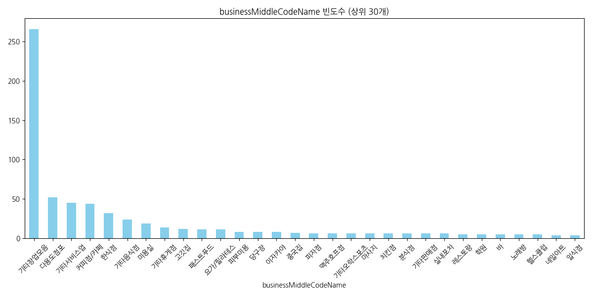
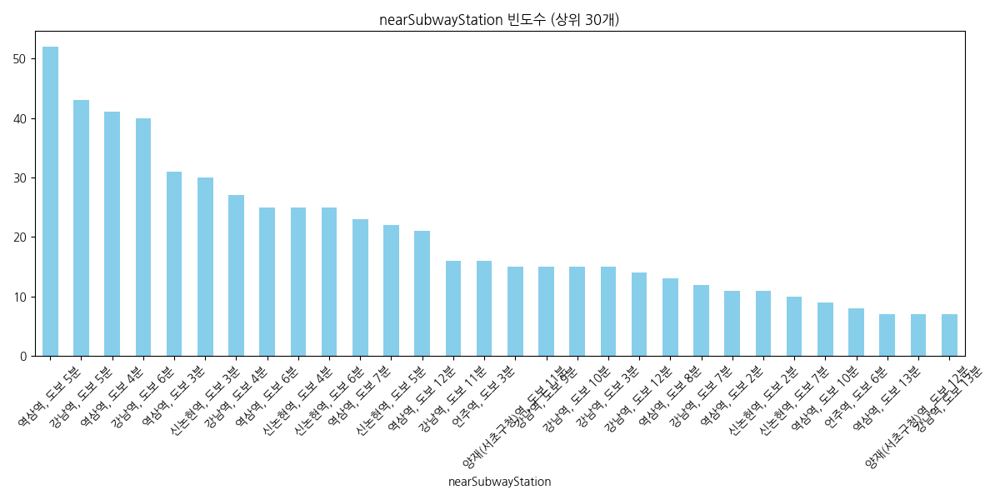

<!-- _class: title -->

# Nemo 상가 데이터 심층 EDA
### 강남/서초 상업용 부동산 시장의 정밀 분석과 전략

**2026년 4월 29일**

---

## 1. 데이터 개요

- **분석 대상**: Nemo API 수집 강남/서초 상가 매물 673건
- **주요 변수**: 업종, 임대료(보증금/월세), 면적, 역세권 정보 등
- **핵심 목표**: 시장의 양극화 현상 파악 및 입지/업종별 수익 최적화 전략 도출

---

## 2. 수치로 본 강남 상권의 진입 장벽

| 지표 | 평균 | 중앙값 (50%) | 상위 10% |
| :--- | :--- | :--- | :--- |
| **보증금** | 6,895만 원 | 4,000만 원 | 15,000만 원 |
| **월세** | 534만 원 | 340만 원 | 1,092만 원 |
| **면적** | 127.6㎡ | 102.2㎡ | 240.0㎡ |

- **인사이트**: 평균이 중앙값보다 현저히 높은 **우편향 분포**.
- 소수의 초고가 매물과 다수의 소형 매물로 시장이 **양극화**되어 있음.

---

## 3. 업종 분포: 비즈니스 허브의 정체성

- **기타창업모음(39%)**: 유연한 공간 수요의 압도적 비중
- **커피점/카페 & 한식점**: 직장인 배후 상권의 견고함 증명
- **인사이트**: 판매 중심에서 **서비스/경험 중심**으로 상권 체질 변화

---

## 4. 입지 가치: 초역세권 5분의 법칙

- **역삼역/강남역 도보 5분 이내** 매물이 전체의 과반 이상 차지.
- **인사이트**: 강남 상권에서 '역과의 거리'는 곧 **매출의 선행 지표**.

---

## 5. 키워드 분석 (TF-IDF)

- **주요 키워드**: `#무권리`, `#인테리어완비`, `#초역세권`, `#강남역`
- **전략**: 초기 투자비(CapEx) 절감 및 즉시 영업 가능한 매물 선호 현상 뚜렷.

---

## 6. 면적 vs 월세 상관관계

- **특이점**: 면적이 좁더라도 입지가 좋으면 월세가 급등하는 **'입지 특이점'** 관찰.
- **결론**: 평수보다 **'입지 집약도'**가 가격 결정의 핵심 변수.

---

## 7. 업종별 보증금 & 요구 면적

| 업종 | 평균 보증금 | 평균 면적 |
| :--- | :--- | :--- |
| **레스토랑** | 1억 7,900만 원 | 176.3㎡ |
| **당구장** | 2,000만 원 | 309.7㎡ |
| **슈퍼마켓** | 1억 2,918만 원 | 243.0㎡ |

- **당구장**: 저가/대형 공간 (지하/상층부 전략)
- **레스토랑**: 고가/고시설 (시설 권리 및 리스크 관리 중요)

---

## 8. 층별 가치 분석

- **1층**: 높은 접근성, 최고 임대료 형성
- **지하/상층부**: 목적형 방문 업종(운동시설, 스튜디오)의 가성비 전략 유효

---

## 9. 종합 인사이트 및 제언

1.  **자산 포지셔닝**: 하이엔드(대로변) vs 마이크로(이면도로) 리그 구분 필요.
2.  **공간의 프리미엄화**: 단순 판매가 아닌 '경험'을 제공하는 공간 설계 필수.
3.  **데이터 기반 의사결정**: 조회수보다 **'즐겨찾기'**가 많은 매물의 조건 분석.
4.  **출구 전략**: 업종 변경이 용이한 다용도 점포 선택으로 리스크 분산.

---

<!-- _class: title -->

# Q&A
### 감사합니다.

**20년 경력 데이터 분석가**
가장 정밀한 상권 분석을 제공합니다.
