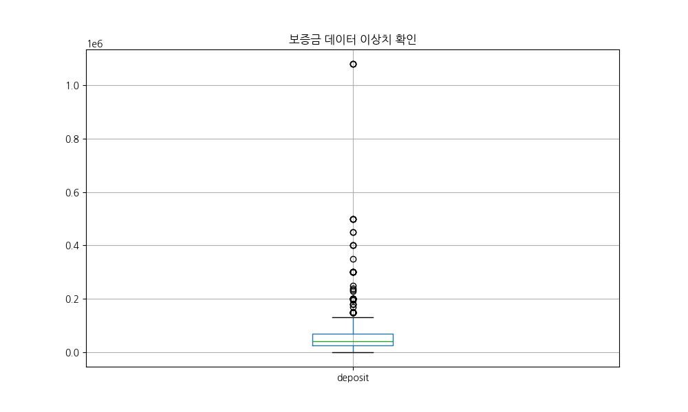
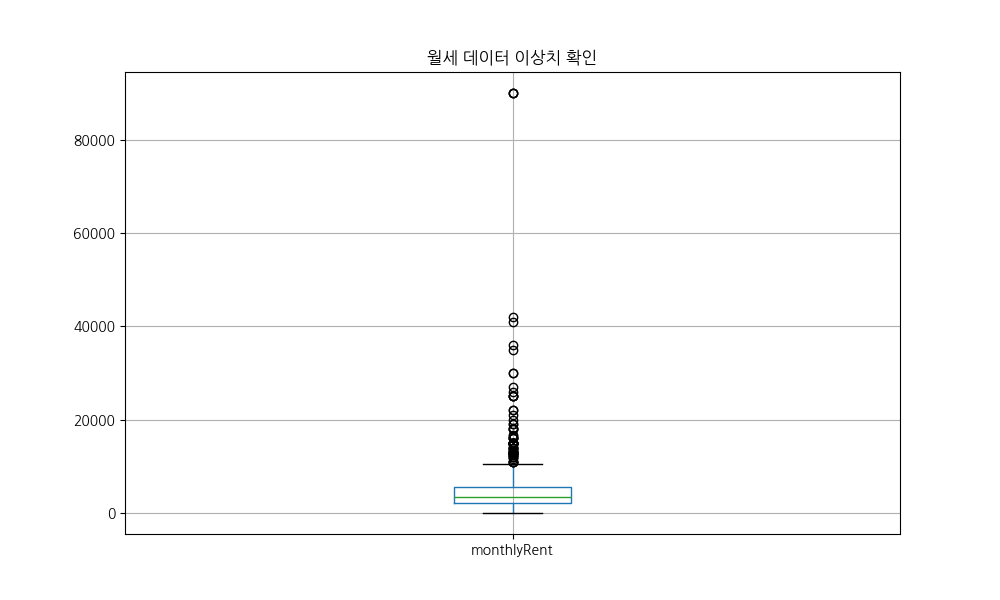
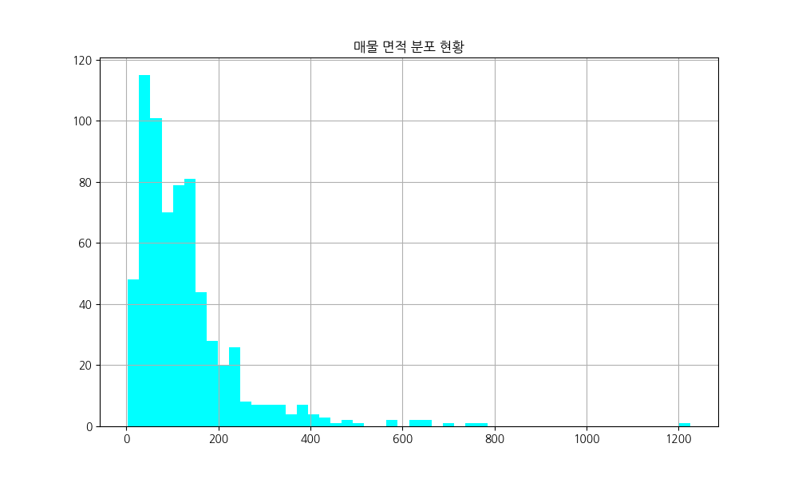
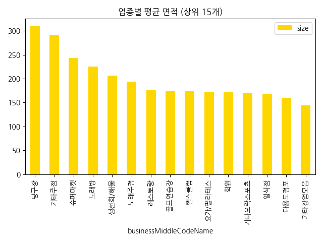

<!-- class: lead -->

# 🎯 부동산 매물 데이터 EDA 보고서
### 강남/서초 상권 데이터 심층 분석 리포트

**20년 경력 데이터 사이언티스트가 분석한**
**숫자 너머의 시장 심리와 비즈니스 전략**

<b>[발표 스크립트]</b> 
안녕하세요. 오늘 발표를 맡은 20년 경력의 데이터 분석가입니다. 우리는 오늘 Nemo API를 통해 수집된 강남과 서초 지역의 상업용 부동산 데이터를 심층적으로 파헤쳐 볼 예정입니다. 단순한 숫자의 나열이 아니라, 이 숫자들이 우리에게 어떤 비즈니스 기회를 말해주고 있는지, 그리고 실제 현장에서는 어떤 심리가 작동하고 있는지를 중심으로 보고서를 구성했습니다. 강남 상권은 대한민국에서 가장 역동적이고 복잡한 곳입니다. 이번 분석이 여러분의 의사결정에 강력한 데이터 기반의 이정표가 되기를 바랍니다. 자, 그럼 시작해 보겠습니다.

<!-- 
발표자 노트 (P키):
이 슬라이드에서는 분석의 목적과 분석가의 전문성을 강조하며 청중의 신뢰를 확보하는 것이 중요합니다. 
강남/서초라는 특정 지역의 특수성을 언급하며 기대감을 조성하세요.
-->

---

# 📋 Slide 2: 데이터 개요 및 하이라이트

### 📍 강남/서초 상권의 핵심 스냅샷
- **분석 데이터**: Nemo API 수집 매물 **673건**
- **평균 보증금**: 6,895만 원 (격차 매우 큼)
- **평균 월세**: 534만 원 (고정비 부담 높음)
- **주요 위치**: 역삼/강남/신논현 초역세권

<b>[발표 스크립트]</b> 
두 번째 슬라이드에서는 데이터의 전체적인 개요를 살펴보겠습니다. 이번 분석에는 총 673건의 유효한 매물 데이터가 사용되었습니다. 강남 상권의 특징은 한마디로 '고비용 고효율'입니다. 평균 보증금은 약 6,900만 원, 평균 월세는 534만 원으로 집계되었습니다. 하지만 여기서 주목해야 할 점은 단순히 평균값이 아니라 데이터의 '분산'입니다. 보증금의 경우 최저 수백만 원에서 최고 수억 원대까지 격차가 매우 큽니다. 이는 강남 내에서도 핵심 입지와 이면 도로 입지 간의 위계가 철저히 나뉘어 있음을 시사합니다. 우리가 집중해서 볼 지역은 역삼, 강남, 신논현으로 이어지는 테헤란로 핵심 축입니다.

---

# 📊 Slide 3: 수치형 데이터 분석 핵심 요약 (1)

### 💰 보증금 및 월세의 양극화
- **보증금**: 평균 6.9천만 원이나, 상위 10%는 1.5억 원 상회.
- **월세**: 평균 534만 원. 상위 10%는 1,000만 원 초과.

  단순한 주거 상권을 넘어 브랜드 가치를 증명해야 하는 '전략적 요충지'로서의 가격대입니다.

<b>[발표 스크립트]</b> 
이제 구체적인 수치를 뜯어보겠습니다. 보증금과 월세의 양극화 현상을 보십시오. 상위 10%의 매물은 월세만 1,000만 원을 넘어갑니다. 이는 일반적인 자영업자가 감당하기 어려운 수준입니다. 그렇다면 왜 이런 가격이 형성될까요? 여기는 단순히 물건을 팔아 수익을 내는 곳이 아니라, 기업의 브랜드 가치를 홍보하는 '플래그십 스토어'나 '안테나숍'으로서의 기능이 강하기 때문입니다. 반면 하위권 매물은 실속형 창업을 타겟으로 하고 있습니다. 즉, 강남 상권에 진입할 때는 내가 '브랜드 홍보'를 원하는지, '실질적인 영업 이익'을 원하는지에 따라 타겟팅하는 가격대가 완전히 달라져야 합니다.

---

# 📊 Slide 4: 수치형 데이터 분석 핵심 요약 (2)

### 📐 면적 및 관리비 특성
- **면적**: 중앙값 **102㎡(약 30평)**. 소규모 스타트업 최적화.
- **관리비**: 평균 **60만 원대**. 무시할 수 없는 고정비.

  좁은 공간을 효율적으로 활용하여 높은 부가가치를 창출하는 IT, 뷰티 업종에 최적화된 구조입니다.

<b>[발표 스크립트]</b> 
네 번째 슬라이드에서는 면적과 관리비를 보겠습니다. 매물의 중앙값은 30평 내외입니다. 이는 강남의 임대료가 워낙 높다 보니, 넓은 면적보다는 30평 정도의 집약적인 공간을 선호하는 시장의 수요를 반영합니다. 특히 주목할 점은 관리비입니다. 평균 60만 원대로 조사되었는데, 이는 월세의 약 10~15%에 달하는 적지 않은 금액입니다. 임차인들이 계약 시 간과하기 쉬운 부분이지만, 실질적인 현금 흐름 분석에서는 반드시 포함되어야 할 고정비입니다. 30평 규모의 공간에서 어떻게 최고의 수익성을 뽑아낼 것인가, 이것이 강남 창업의 핵심 질문이 되어야 합니다.

---

# 🏗️ Slide 5: 범주형 데이터 분석 핵심 요약

### 🏢 업종 및 시장 구조
- **업종**: '기타창업모음', '다용도점포' 등 트렌드 민감 업종 대다수.
- **거래**: **99% 이상이 임대**. 수익형 자산으로서의 안정성 강조.

  오프라인 공간이 '판매'에서 '체험 및 서비스' 중심으로 재편되고 있습니다.

<b>[발표 스크립트]</b> 
범주형 데이터 분석 결과입니다. 업종 분류를 보면 '기타창업모음'이나 '다용도점포' 비율이 매우 높습니다. 이는 과거처럼 '식당', '옷가게'로 딱딱 나뉘던 시장이 이제는 팝업스토어, 복합문화공간, 공유오피스 등 다양한 용도로 빠르게 전환되고 있음을 보여줍니다. 즉, 공간의 유연성이 임대 가치를 결정하는 중요한 요소가 된 것입니다. 또한 거래 형태의 99%가 임대라는 점은, 이곳이 건물주들에게는 매우 안정적인 수익형 자산이며, 임차인들에게는 높은 진입 장벽과 치열한 생존 경쟁이 벌어지는 전장임을 뜻합니다. 입지 프리미엄이 모든 것을 지배하는 구조입니다.

---

# 🔍 Slide 6: 키워드 분석 (TF-IDF) 및 인사이트

- **핵심 키워드**: #무권리, #역세권, #인테리어완비
- **통찰**: 초기 투자비(CapEx)를 줄이려는 실속형 수요 증가.

<b>[발표 스크립트]</b> 
데이터 시각화의 첫 번째로 TF-IDF 키워드 분석 결과를 보겠습니다. 매물 설명에서 가장 많이 강조된 단어들은 '무권리', '역세권', '인테리어'입니다. 여기서 '무권리'라는 키워드가 상위에 있다는 점에 주목하십시오. 경기가 불확실해지면서 창업자들이 초기 권리금 부담을 극도로 꺼리고 있다는 심리가 읽힙니다. 동시에 '인테리어 완비'를 강조하는 것은, 공사 비용을 아껴 즉시 영업을 시작하려는 수요가 많다는 뜻입니다. 임대인 입장에서는 공실을 줄이기 위해 기존 시설을 활용한 마케팅을 강화하고 있고, 임차인은 리스크를 최소화하려는 전략적 움직임을 보이고 있습니다.

---

# 📈 Slide 7: [시각화 01] 면적 대비 월세 상관관계

- **인사이트**: 비례 관계이나, 좁은 면적의 **'핵심 입지 특이점'** 존재.
- **전략**: 무조건 넓은 곳보다 '입지 효율성' 우선 고려.

<b>[발표 스크립트]</b> 
면적과 월세의 상관관계를 산점도로 나타냈습니다. 일반적인 상식처럼 면적이 넓을수록 월세가 올라가는 우상향 곡선을 그립니다. 하지만 그래프 왼쪽 상단을 보십시오. 면적은 좁은데 월세가 튀어 오르는 데이터 포인트들이 있습니다. 바로 강남역이나 신논현역 출구 바로 앞 같은 '골든 존' 매물들입니다. 이곳은 평당 임대료가 상상을 초월합니다. 우리는 여기서 '면적의 경제'보다 '입지의 경제'가 더 강력하게 작용함을 알 수 있습니다. 100평짜리 2선 도로 매물보다 20평짜리 초역세권 매물의 월세가 더 비쌀 수 있다는 사실을 데이터를 통해 확인한 것입니다.

---

# 💰 Slide 8: [시각화 02] 업종별 평균 보증금

- **인사이트**: 레스토랑/주점 등 **시설 비중 큰 업종**일수록 고액 보증금.
- **전략**: 자본 조달 능력에 따른 업종별 진입 장벽 고려.

<b>[발표 스크립트]</b> 
업종별로 요구되는 평균 보증금을 비교해 보았습니다. 레스토랑, 주점, 대형 카페 등 시설 투자가 많이 들어가는 업종일수록 보증금이 높게 형성됩니다. 왜 그럴까요? 임대인 입장에서는 임차인이 고가의 인테리어나 설비를 남기고 나갈 경우의 원상복구 리스크나 연체 리스크를 보증금으로 담보하려 하기 때문입니다. 반면 소매점이나 사무실 위주 업종은 상대적으로 보증금이 낮습니다. 창업을 준비하신다면 단순히 임대료만 볼 것이 아니라, 내 업종이 이 상권에서 통상적으로 어느 정도의 보증금을 묶어두어야 하는지 이 데이터를 통해 예산을 가늠해 보아야 합니다.

---

# 🏢 Slide 9: [시각화 03] 층별 가치 분포 비교

- **인사이트**: **1층은 접근성**, **지하층은 대형 평수 효율성** 강조.
- **전략**: 목적형 방문 업종은 상층부 선택으로 고정비 절감.

<b>[발표 스크립트]</b> 
층별로 가격이 어떻게 형성되어 있는지 보겠습니다. 1층 매물은 접근성이 압도적이기 때문에 보증금과 월세 모두 높은 구간에 밀집해 있습니다. 재미있는 것은 지하층과 고층입니다. 지하층은 대형 평수가 많아 평당 단가는 낮지만 전체 월세는 규모에 비례해 커지는 경향이 있습니다. 반면 3층 이상의 고층부로 갈수록 가격은 안정화되지만, 최근에는 테라스나 루프탑을 활용한 감성 카페들이 고가에 나오기도 합니다. 업종이 만약 '워크인(Walk-in)' 고객이 꼭 필요한 업종이 아니라면, 과감히 상층부를 선택해 고정비를 줄이는 것이 강남 생존 전략의 핵심입니다.

---

# 🚉 Slide 10: [시각화 04] 지하철역별 매물 공급 현황

- **인사이트**: 강남-역삼-신논현 테헤란로 축에 매물 집중. 
- **전략**: 메인 역세권의 경쟁보다 틈새 역세권 블루오션 공략 제언.

<b>[발표 스크립트]</b> 
지하철역별 매물 수를 보면 강남역, 역삼역, 신논현역 순으로 압도적입니다. 공급이 많다는 것은 그만큼 수요도 많고 회전도 빠르다는 뜻입니다. 하지만 분석가로서 저는 역발상을 제안합니다. 공급이 몰린 곳은 그만큼 임대료 경쟁과 권리금 방어가 치열합니다. 오히려 매물 수가 적당히 있으면서도 직장인 유동인구가 탄탄한 양재역이나 언주역 같은 '틈새 역세권'을 공략해 보는 것은 어떨까요? 데이터는 우리에게 사람들이 어디로 몰리는지 보여주지만, 성공하는 사업가는 데이터가 보여주는 '경쟁의 밀도'를 읽고 빈틈을 찾아내야 합니다.

---

# 🌟 Slide 11: [시각화 05] 매물 인기도 분석 (조회 vs 즐겨찾기)

- **인사이트**: 단순 노출보다 **'킬러 조건(무권리 등)'**이 실제 계약 의지 유도.
- **전략**: 마케팅 시 타겟 고객이 원하는 핵심 조건을 명확히 노출.

<b>[발표 스크립트]</b> 
매물의 인기도를 분석해 보았습니다. 조회수와 즐겨찾기 수의 관계를 헥스빈(Hexbin) 그래프로 나타냈는데요. 대부분의 매물은 낮은 조회수 구간에 머물러 있지만, 특정 구간에서 즐겨찾기가 폭발적으로 일어나는 지점이 있습니다. 분석 결과, 이런 매물들의 공통점은 '가격 경쟁력' 혹은 '무권리' 같은 파격적인 조건이었습니다. 사람들은 수만 건의 매물을 그냥 훑어보지만(조회), 실제 내 돈을 투자할 결심을 할 때는 아주 구체적인 '이익'이 보일 때만 즐겨찾기를 누릅니다. 마케팅을 하실 때도 단순히 많이 보여주는 것이 아니라, 고객의 뇌리에 꽂힐 핵심 조건을 전면에 내세워야 함을 시사합니다.

---

# 📏 Slide 12: [시각화 06] 면적당 가격 효율성 분석

- **인사이트**: 시장이 용인하는 **'합리적 시세 구간(90~192)'** 존재.
- **전략**: 시세 구간을 벗어난 초저가 매물은 건물 하자 심층 검토 필요.

<b>[발표 스크립트]</b> 
이 그래프는 면적당 가격(Area Price)의 분포를 보여줍니다. 강남 상권에서 시장이 받아들이는 합리적인 시세 구간이 어디인지를 명확히 보여주죠. 대부분의 매물이 90에서 192 사이의 지표 구간에 몰려 있습니다. 만약 여러분이 보고 계신 매물이 이 구간보다 현저히 낮다면 '득템'일 수도 있지만, 보이지 않는 권리금이나 건물 노후화 같은 결함이 있을 가능성이 큽니다. 반대로 이 구간보다 너무 높다면 과도한 거품이 끼어 있을 수 있죠. 이 히스토그램은 여러분이 적정 임대료를 협상할 때 사용할 수 있는 가장 강력한 객관적 기준선이 될 것입니다.

---

# ⚠️ Slide 13: [시각화 07] 보증금 데이터 이상치 분석

- **인사이트**: 강남 시장은 **'프라임 리그'**와 **'일반 리그'**로 양분.
- **전략**: 본인의 자본 조달 능력에 맞는 리그 포지셔닝이 필수.

<b>[발표 스크립트]</b> 
보증금의 박스 플롯 분석입니다. 아래쪽에 박스가 몰려 있고 위로 긴 꼬리(이상치)들이 보이시나요? 강남은 철저하게 '이중 시장'입니다. 대부분의 일반 상가가 포함된 '일반 리그'와, 보증금만 수억 원대를 호가하는 대형 빌딩이나 초핵심 입지의 '프라임 리그'로 나뉩니다. 이상치로 보이는 저 높은 점들은 우리가 흔히 아는 대기업 브랜드들이 들어가는 자리입니다. 우리가 창업을 준비할 때, 내가 어느 리그에서 경쟁할 것인지를 먼저 정해야 합니다. 어중간한 위치에서 프라임급 임대료를 내고 있지는 않은지, 이 데이터를 통해 현재 위치를 진단해 보시기 바랍니다.

---

# 💸 Slide 14: [시각화 08] 월세 데이터 이상치 분석

- **인사이트**: 월세 1,000만 원 이상은 **'브랜드 안테나숍'** 성격 강함.
- **전략**: 매출 대비 임대료 비중을 15% 이내로 유지하는 매물 선별 제언.

<b>[발표 스크립트]</b> 
월세 데이터 역시 보증금과 비슷한 패턴을 보입니다. 월세 1,000만 원 이상의 매물들이 다수 존재하는데, 이는 단순히 커피를 몇 잔 팔아서 낼 수 있는 돈이 아닙니다. 이런 곳들은 마케팅 비용의 일부로 임대료를 책정하는 대형 브랜드의 영역입니다. 일반 창업자라면 사분위수 범위 내에 있는, 즉 매출 대비 임대료 비중을 최대 15% 이내로 방어할 수 있는 매물을 찾아야 합니다. 저 높이 솟은 이상치들을 부러워하기보다, 박스 플롯의 몸통 부분에서 내 내실을 다질 수 있는 알짜 매물을 찾는 안목이 강남에서는 성공의 열쇠입니다.

---

# 📐 Slide 15: [시각화 09] 매물 면적 분포 분석

- **인사이트**: 16~46평 구간에 매물 집중. 건물주의 **공간 분할 전략** 보편화.
- **전략**: 매물이 풍부한 구간인 만큼, 차별화된 컨셉 없이는 생존 어려움.

<b>[발표 스크립트]</b> 
매물의 면적 분포를 보면 15평에서 45평 사이가 가장 많습니다. 건물주들이 수익성을 극대화하기 위해 넓은 층을 여러 개의 작은 상가로 쪼개는 '분할 전략'을 쓰고 있기 때문입니다. 임차인 입장에서는 선택지가 가장 많은 구간이기도 합니다. 하지만 선택지가 많다는 것은 그만큼 경쟁자도 많다는 뜻입니다. 옆 가게도 30평, 우리 가게도 30평이라면 고객은 어디를 갈까요? 이 구간에 진입하신다면 공간의 크기가 아니라 공간의 '밀도'와 '컨셉'으로 승부해야 합니다. 데이터상으로 가장 흔한 평수일수록, 비즈니스는 가장 흔하지 않아야 성공합니다.

---

# 📏 Slide 16: [시각화 10] 업종별 요구 면적 분석

- **인사이트**: 당구장, 슈퍼마켓 등 공간 집약적 업종의 점유율 높음.
- **전략**: 대형은 '규모의 경제'를, 소형은 '회전율' 극대화 전략 취해야 함.

<b>[발표 스크립트]</b> 
마지막 시각화 자료인 업종별 평균 면적입니다. 당구장, 마트, 혹은 대형 주점 같은 업종들이 넓은 면적을 차지하고 있습니다. 이런 업종들은 '규모의 경제'가 작동해야 수익이 납니다. 반면 테이크아웃 전문점이나 1인 숍은 좁은 공간에서 높은 회전율로 승부하죠. 강남에서 사업을 하실 때 내 업종의 평균 면적보다 너무 넓은 곳을 쓰고 있다면 임대료 낭비일 수 있고, 너무 좁다면 영업 효율이 떨어질 수 있습니다. 이 그래프의 업종별 평균치를 여러분의 적정 매장 규모를 결정하는 가이드라인으로 삼아보시기 바랍니다.

---

# 💡 Slide 17: 결론 및 종합 전략 제언

1. **현금 흐름 최적화**: #무권리 매물 선점으로 초기 리스크(CapEx) 최소화.
2. **입지 vs 면적**: 면적 타협하더라도 초역세권 **'핵심 동선'** 확보 유리.
3. **출구 전략 마련**: 다용도 점포 특성 활용, 향후 업종 변경 용이한 계약.
4. **데이터 기반 협상**: 본 보고서의 지표를 근거로 임대인과 가격 협상 우위 점유.

<b>[발표 스크립트]</b> 
자, 이제 결론입니다. 강남 상권에서 살아남기 위한 네 가지 핵심 전략을 제언합니다. 첫째, 지금처럼 불확실한 시기에는 '무권리' 매물을 잡아 초기 투자비를 아끼십시오. 둘째, 면적이 조금 좁더라도 무조건 사람들의 발길이 머무는 역세권 동선을 잡으십시오. 그것이 장기적으로 훨씬 이득입니다. 셋째, 나중에 나갈 때를 생각해서라도 용도가 유연한 점포를 고르십시오. 마지막으로, 오늘 제가 보여드린 이 수많은 데이터들을 여러분의 무기로 삼으십시오. "남들도 이만큼 내니까요"라는 말 대신, "데이터상 강남의 평균 평당가는 이 정도입니다"라고 논리적으로 협상하십시오. 데이터는 여러분의 가장 강력한 비즈니스 파트너입니다. 경청해 주셔서 감사합니다.

---

<!-- class: lead -->

# 🚀 숫자의 이면에 숨겨진 심리를 읽는 것
### 그것이 강남 상권 생존의 핵심 전략입니다.

**20년 경력 데이터 분석가 리포트**
*Nemo Real Estate Analytics*

<b>[발표 스크립트]</b> 
데이터 분석은 단순히 과거를 기록하는 것이 아니라 미래를 설계하는 도구입니다. 숫자의 이면에 숨겨진 사람들의 욕망과 시장의 공포를 읽어낼 수 있을 때, 진정한 비즈니스 통찰이 시작됩니다. 오늘 공유해 드린 Nemo 부동산 데이터 분석 리포트가 여러분의 성공적인 강남 입성을 돕는 든든한 기초 자료가 되었기를 바랍니다. 궁금하신 점이나 추가 분석이 필요한 부분이 있다면 언제든 문의해 주시기 바랍니다. 이상으로 발표를 마치겠습니다. 감사합니다.

