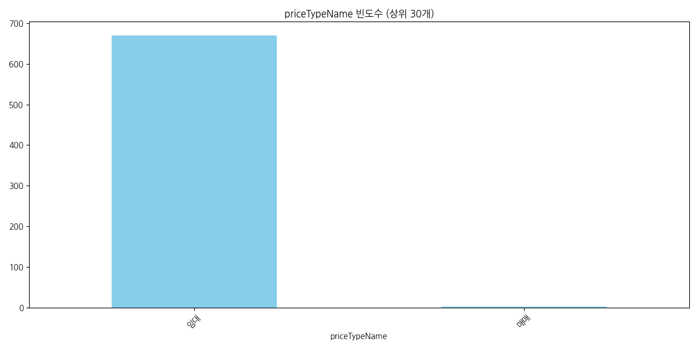

# Nemo 상가 데이터 심층 EDA 보고서

본 보고서는 Nemo API를 통해 수집된 상가 매물 데이터의 통계적 특성과 시장 동향을 20년 경력의 데이터 분석가 관점에서 심층 분석한 결과입니다.

## 1. 데이터 개요 및 구조 확인

### 데이터 스냅샷 (상위 5개 행)
|    | isPriority   |   articleType | id                                   |   buildingManagementSerialNumber | agentId   |   number | previewPhotoUrl                                                                  | smallPhotoUrls                                                                                                                                                                                                                                                                                                                                                                                                                                                                                                                                                                                                                                                                                                                                                                                                                                                                                                                                                                                                                                                                                                                                                                                                                                                                                               | originPhotoUrls                                                                                                                                                                                                                                                                                                                                                                                                                                                                                                                                                                                                                                                                                                                                                                                                                                                                                                                                                                                                                                                                                                                                                                                                                                                                                              |   businessLargeCode | businessLargeCodeName   |   businessMiddleCode | businessMiddleCodeName   |   priceType | priceTypeName   |   deposit |   monthlyRent |   isPremiumClosed |   premium |   sale |   maintenanceFee |   floor |   groundFloor |   size | title                  |   firstDeposit |   firstMonthlyRent |   firstPremium |   confirmedDateUtc | nearSubwayStation   |   viewCount |   favoriteCount | isInYourFavorited   |   isMoveInDate |   moveInDate |   completionConfirmedDateUtc | createdDateUtc                   | editedDateUtc                    |   state |   areaPrice |
|---:|:-------------|--------------:|:-------------------------------------|---------------------------------:|:----------|---------:|:---------------------------------------------------------------------------------|:-------------------------------------------------------------------------------------------------------------------------------------------------------------------------------------------------------------------------------------------------------------------------------------------------------------------------------------------------------------------------------------------------------------------------------------------------------------------------------------------------------------------------------------------------------------------------------------------------------------------------------------------------------------------------------------------------------------------------------------------------------------------------------------------------------------------------------------------------------------------------------------------------------------------------------------------------------------------------------------------------------------------------------------------------------------------------------------------------------------------------------------------------------------------------------------------------------------------------------------------------------------------------------------------------------------|:-------------------------------------------------------------------------------------------------------------------------------------------------------------------------------------------------------------------------------------------------------------------------------------------------------------------------------------------------------------------------------------------------------------------------------------------------------------------------------------------------------------------------------------------------------------------------------------------------------------------------------------------------------------------------------------------------------------------------------------------------------------------------------------------------------------------------------------------------------------------------------------------------------------------------------------------------------------------------------------------------------------------------------------------------------------------------------------------------------------------------------------------------------------------------------------------------------------------------------------------------------------------------------------------------------------|--------------------:|:------------------------|---------------------:|:-------------------------|------------:|:----------------|----------:|--------------:|------------------:|----------:|-------:|-----------------:|--------:|--------------:|-------:|:-----------------------|---------------:|-------------------:|---------------:|-------------------:|:--------------------|------------:|----------------:|:--------------------|---------------:|-------------:|-----------------------------:|:---------------------------------|:---------------------------------|--------:|------------:|
|  0 |              |             1 | 758d5af1-2829-450b-acff-7fdc04bbbf7a |        1168010100108170030027546 |           |   936139 | https://img.nemoapp.kr/article-photos/e25c6db2-f845-49c5-b8de-b8526ecd1ac5/s.jpg | ['https://img.nemoapp.kr/article-photos/e25c6db2-f845-49c5-b8de-b8526ecd1ac5/s.jpg', 'https://img.nemoapp.kr/article-photos/7e0160c9-db36-400e-8d9c-8f7072ca7422/s.jpg', 'https://img.nemoapp.kr/article-photos/e6ce1706-de38-49d2-87b1-faff6e898081/s.jpg', 'https://img.nemoapp.kr/article-photos/e8607ed0-0d32-447c-a2c8-b78e1a57704e/s.jpg', 'https://img.nemoapp.kr/article-photos/2b717b16-1036-4f5b-9ba2-53315238fa01/s.jpg', 'https://img.nemoapp.kr/article-photos/86c7f4bf-eb9d-4114-9663-ad10c712c6ea/s.jpg', 'https://img.nemoapp.kr/article-photos/c8ba22cf-79d5-4ca0-9662-4309b6ba149b/s.jpg', 'https://img.nemoapp.kr/article-photos/c5441ebb-dbc2-458b-9b87-435a244a1976/s.jpg', 'https://img.nemoapp.kr/article-photos/74bf8f81-aa11-4c6e-91d5-932ede11a878/s.jpg', 'https://img.nemoapp.kr/article-photos/5a655698-7f00-4f2b-b9e6-ddf4bc04ed00/s.jpg', 'https://img.nemoapp.kr/article-photos/6d0bc82a-4fd6-4bdb-b10f-51d455b3e897/s.jpg', 'https://img.nemoapp.kr/article-photos/6f0f41c2-03d7-4986-b8db-e91f70d5ba28/s.jpg', 'https://img.nemoapp.kr/article-photos/f21bb019-c092-48ec-9dd5-1c465751abf6/s.jpg']                                                                                                                                                                         | ['https://img.nemoapp.kr/article-photos/e25c6db2-f845-49c5-b8de-b8526ecd1ac5/l.jpg', 'https://img.nemoapp.kr/article-photos/7e0160c9-db36-400e-8d9c-8f7072ca7422/l.jpg', 'https://img.nemoapp.kr/article-photos/e6ce1706-de38-49d2-87b1-faff6e898081/l.jpg', 'https://img.nemoapp.kr/article-photos/e8607ed0-0d32-447c-a2c8-b78e1a57704e/l.jpg', 'https://img.nemoapp.kr/article-photos/2b717b16-1036-4f5b-9ba2-53315238fa01/l.jpg', 'https://img.nemoapp.kr/article-photos/86c7f4bf-eb9d-4114-9663-ad10c712c6ea/l.jpg', 'https://img.nemoapp.kr/article-photos/c8ba22cf-79d5-4ca0-9662-4309b6ba149b/l.jpg', 'https://img.nemoapp.kr/article-photos/c5441ebb-dbc2-458b-9b87-435a244a1976/l.jpg', 'https://img.nemoapp.kr/article-photos/74bf8f81-aa11-4c6e-91d5-932ede11a878/l.jpg', 'https://img.nemoapp.kr/article-photos/5a655698-7f00-4f2b-b9e6-ddf4bc04ed00/l.jpg', 'https://img.nemoapp.kr/article-photos/6d0bc82a-4fd6-4bdb-b10f-51d455b3e897/l.jpg', 'https://img.nemoapp.kr/article-photos/6f0f41c2-03d7-4986-b8db-e91f70d5ba28/l.jpg', 'https://img.nemoapp.kr/article-photos/f21bb019-c092-48ec-9dd5-1c465751abf6/l.jpg']                                                                                                                                                                         |                  17 | 기타업종                    |                 1709 | 기타창업모음                   |           1 | 임대              |     25000 |          2300 |                 0 |         0 |      0 |              100 |       6 |             6 |  66.12 | ■ 강남역 3분 탑층 아릿다운 사무실 ■ |          25000 |               2300 |              0 |                nan | 강남역, 도보 5분          |          13 |               0 |                     |              1 |          nan |                          nan | 2026-04-15T06:32:22.769312+00:00 | 2026-04-27T00:18:27.914154+00:00 |       1 |         120 |
|  1 |              |             1 | eac574b3-1ac6-4173-8190-8287841025dd |        1168010100108360048026079 |           |   929744 | https://img.nemoapp.kr/article-photos/97405add-f154-4535-837a-8ced41e4cf8b/s.jpg | ['https://img.nemoapp.kr/article-photos/97405add-f154-4535-837a-8ced41e4cf8b/s.jpg', 'https://img.nemoapp.kr/article-photos/39f06bb8-8ff6-4c50-9126-5d83fdcc4670/s.jpg', 'https://img.nemoapp.kr/article-photos/b325b2e7-2d3d-46c8-b395-42c856691e1e/s.jpg', 'https://img.nemoapp.kr/article-photos/ba628937-f976-4a83-837b-b9fa0e241470/s.jpg', 'https://img.nemoapp.kr/article-photos/7b04acaa-e1e6-4b9f-b468-9e2a45043f9a/s.jpg', 'https://img.nemoapp.kr/article-photos/802bec95-5c74-4393-9a17-d10bef57f0ba/s.jpg', 'https://img.nemoapp.kr/article-photos/7c6479b2-e55d-43ad-90bb-a0d17dcced10/s.jpg', 'https://img.nemoapp.kr/article-photos/81247108-4e40-45c9-9e80-6fecdcf3ae28/s.jpg', 'https://img.nemoapp.kr/article-photos/191b1043-00b8-4e61-b869-9fab2c03f8d8/s.jpg', 'https://img.nemoapp.kr/article-photos/7d86921f-f6f6-4d7b-9631-8c74f0afcd85/s.jpg']                                                                                                                                                                                                                                                                                                                                                                                                                                     | ['https://img.nemoapp.kr/article-photos/97405add-f154-4535-837a-8ced41e4cf8b/l.jpg', 'https://img.nemoapp.kr/article-photos/39f06bb8-8ff6-4c50-9126-5d83fdcc4670/l.jpg', 'https://img.nemoapp.kr/article-photos/b325b2e7-2d3d-46c8-b395-42c856691e1e/l.jpg', 'https://img.nemoapp.kr/article-photos/ba628937-f976-4a83-837b-b9fa0e241470/l.jpg', 'https://img.nemoapp.kr/article-photos/7b04acaa-e1e6-4b9f-b468-9e2a45043f9a/l.jpg', 'https://img.nemoapp.kr/article-photos/802bec95-5c74-4393-9a17-d10bef57f0ba/l.jpg', 'https://img.nemoapp.kr/article-photos/7c6479b2-e55d-43ad-90bb-a0d17dcced10/l.jpg', 'https://img.nemoapp.kr/article-photos/81247108-4e40-45c9-9e80-6fecdcf3ae28/l.jpg', 'https://img.nemoapp.kr/article-photos/191b1043-00b8-4e61-b869-9fab2c03f8d8/l.jpg', 'https://img.nemoapp.kr/article-photos/7d86921f-f6f6-4d7b-9631-8c74f0afcd85/l.jpg']                                                                                                                                                                                                                                                                                                                                                                                                                                     |                  16 | 서비스업                    |                 1609 | 기타서비스업                   |           1 | 임대              |     30000 |          2500 |                 0 |         0 |      0 |              300 |       2 |             5 |  89.26 | 눈부신 스튜디오 의류사무실         |          30000 |               2500 |              0 |                nan | 양재(서초구청)역, 도보 11분   |           1 |               2 |                     |              1 |          nan |                          nan | 2026-03-11T00:49:05.429772+00:00 | 2026-04-27T00:08:37.04809+00:00  |       1 |          97 |
|  2 |              |             1 | ae9fcb83-ed8b-48a1-a6c0-9144113e17d7 |        1168010100107930018000001 |           |   930853 | https://img.nemoapp.kr/article-photos/4e429587-0275-4d00-998f-45a823dbd949/s.jpg | ['https://img.nemoapp.kr/article-photos/4e429587-0275-4d00-998f-45a823dbd949/s.jpg', 'https://img.nemoapp.kr/article-photos/3e07e906-af2f-4b93-b2ee-8f5acf0788f5/s.jpg', 'https://img.nemoapp.kr/article-photos/28663a70-5217-4c45-8fdd-39c0e540eec9/s.jpg', 'https://img.nemoapp.kr/article-photos/c1c6fcf1-6276-4936-8352-24b38eb31366/s.jpg', 'https://img.nemoapp.kr/article-photos/3105d7bb-dc0b-4f48-a378-75473a32b078/s.jpg', 'https://img.nemoapp.kr/article-photos/75a0e0df-3426-42f8-9cf8-b9399b06f052/s.jpg', 'https://img.nemoapp.kr/article-photos/c40e23d1-0c85-4c07-833d-2dccd4044849/s.jpg', 'https://img.nemoapp.kr/article-photos/02923a46-3b4e-4693-934f-be2aac158d0b/s.jpg', 'https://img.nemoapp.kr/article-photos/bb233a85-d15a-4f45-9855-3f00efc434e7/s.jpg', 'https://img.nemoapp.kr/article-photos/e93fe74c-b11d-4aca-89e5-074daa9bb52e/s.jpg']                                                                                                                                                                                                                                                                                                                                                                                                                                     | ['https://img.nemoapp.kr/article-photos/4e429587-0275-4d00-998f-45a823dbd949/l.jpg', 'https://img.nemoapp.kr/article-photos/3e07e906-af2f-4b93-b2ee-8f5acf0788f5/l.jpg', 'https://img.nemoapp.kr/article-photos/28663a70-5217-4c45-8fdd-39c0e540eec9/l.jpg', 'https://img.nemoapp.kr/article-photos/c1c6fcf1-6276-4936-8352-24b38eb31366/l.jpg', 'https://img.nemoapp.kr/article-photos/3105d7bb-dc0b-4f48-a378-75473a32b078/l.jpg', 'https://img.nemoapp.kr/article-photos/75a0e0df-3426-42f8-9cf8-b9399b06f052/l.jpg', 'https://img.nemoapp.kr/article-photos/c40e23d1-0c85-4c07-833d-2dccd4044849/l.jpg', 'https://img.nemoapp.kr/article-photos/02923a46-3b4e-4693-934f-be2aac158d0b/l.jpg', 'https://img.nemoapp.kr/article-photos/bb233a85-d15a-4f45-9855-3f00efc434e7/l.jpg', 'https://img.nemoapp.kr/article-photos/e93fe74c-b11d-4aca-89e5-074daa9bb52e/l.jpg']                                                                                                                                                                                                                                                                                                                                                                                                                                     |                  16 | 서비스업                    |                 1607 | 부동산중개소                   |           1 | 임대              |     20000 |          2500 |                 0 |         0 |      0 |              300 |       5 |             5 |  50    | 신축 단독루프탑 럭셔리의 끝        |          20000 |               2500 |              0 |                nan | 역삼역, 도보 13분         |           3 |               3 |                     |              1 |          nan |                          nan | 2026-03-17T09:33:52.116843+00:00 | 2026-04-27T00:08:32.569573+00:00 |       1 |         171 |
|  3 |              |             1 | a422196f-5c2f-4dde-9340-6acc6995fe6d |        1168010100108350066026044 |           |   923127 | https://img.nemoapp.kr/article-photos/17ab3134-59dc-488e-b0fb-33dcc5cb6b59/s.jpg | ['https://img.nemoapp.kr/article-photos/17ab3134-59dc-488e-b0fb-33dcc5cb6b59/s.jpg', 'https://img.nemoapp.kr/article-photos/5f5fbaaf-9afc-4072-ae74-04f9e772d673/s.jpg', 'https://img.nemoapp.kr/article-photos/a6c42cbc-08e7-4d9d-816e-f7a0b0eb95fd/s.jpg', 'https://img.nemoapp.kr/article-photos/ac642aa5-ee8f-4cef-b2e8-8a1f1222f196/s.jpg', 'https://img.nemoapp.kr/article-photos/5264eda2-95a5-4436-8e5b-9a526a12d55c/s.jpg', 'https://img.nemoapp.kr/article-photos/ebdac635-283f-4fc5-97ae-98bc9a469dd2/s.jpg', 'https://img.nemoapp.kr/article-photos/79bed437-3cf6-4e47-9900-58d0a7fc821d/s.jpg', 'https://img.nemoapp.kr/article-photos/da159bce-22b1-4adc-8eee-214ae0c0e3a7/s.jpg', 'https://img.nemoapp.kr/article-photos/19086bb7-d99a-416c-8ef0-2599dfc5ff0c/s.jpg', 'https://img.nemoapp.kr/article-photos/dc45aa32-8cd6-460e-ad8a-c78e4ab0b491/s.jpg', 'https://img.nemoapp.kr/article-photos/1008710b-00c4-4f38-88d6-7de2e4928362/s.jpg', 'https://img.nemoapp.kr/article-photos/3bc6eb04-cc09-4e21-a5d7-6c4af7d83af0/s.jpg', 'https://img.nemoapp.kr/article-photos/e740f79d-ecf5-4526-acce-45ef8f5eb10a/s.jpg', 'https://img.nemoapp.kr/article-photos/a96d7057-3cdf-45ef-b78c-9bfcc9109747/s.jpg', 'https://img.nemoapp.kr/article-photos/d9e34c49-2f49-4221-bf81-612fa268846f/s.jpg'] | ['https://img.nemoapp.kr/article-photos/17ab3134-59dc-488e-b0fb-33dcc5cb6b59/l.jpg', 'https://img.nemoapp.kr/article-photos/5f5fbaaf-9afc-4072-ae74-04f9e772d673/l.jpg', 'https://img.nemoapp.kr/article-photos/a6c42cbc-08e7-4d9d-816e-f7a0b0eb95fd/l.jpg', 'https://img.nemoapp.kr/article-photos/ac642aa5-ee8f-4cef-b2e8-8a1f1222f196/l.jpg', 'https://img.nemoapp.kr/article-photos/5264eda2-95a5-4436-8e5b-9a526a12d55c/l.jpg', 'https://img.nemoapp.kr/article-photos/ebdac635-283f-4fc5-97ae-98bc9a469dd2/l.jpg', 'https://img.nemoapp.kr/article-photos/79bed437-3cf6-4e47-9900-58d0a7fc821d/l.jpg', 'https://img.nemoapp.kr/article-photos/da159bce-22b1-4adc-8eee-214ae0c0e3a7/l.jpg', 'https://img.nemoapp.kr/article-photos/19086bb7-d99a-416c-8ef0-2599dfc5ff0c/l.jpg', 'https://img.nemoapp.kr/article-photos/dc45aa32-8cd6-460e-ad8a-c78e4ab0b491/l.jpg', 'https://img.nemoapp.kr/article-photos/1008710b-00c4-4f38-88d6-7de2e4928362/l.jpg', 'https://img.nemoapp.kr/article-photos/3bc6eb04-cc09-4e21-a5d7-6c4af7d83af0/l.jpg', 'https://img.nemoapp.kr/article-photos/e740f79d-ecf5-4526-acce-45ef8f5eb10a/l.jpg', 'https://img.nemoapp.kr/article-photos/a96d7057-3cdf-45ef-b78c-9bfcc9109747/l.jpg', 'https://img.nemoapp.kr/article-photos/d9e34c49-2f49-4221-bf81-612fa268846f/l.jpg'] |                  17 | 기타업종                    |                 1709 | 기타창업모음                   |           1 | 임대              |     30000 |          1600 |                 0 |         0 |      0 |              100 |      -1 |             5 |  59.5  | 🔴🔴 스튜디오 작업실 소형사무실 🔴🔴   |          30000 |               1600 |              0 |                nan | 양재(서초구청)역, 도보 12분   |           1 |               3 |                     |              1 |          nan |                          nan | 2026-01-22T08:07:33.747622+00:00 | 2026-04-26T23:34:38.608209+00:00 |       1 |          96 |
|  4 |              |             1 | 381630b1-0701-4190-a895-2168b6a17779 |        1168010100107510018025392 |           |   931002 | https://img.nemoapp.kr/article-photos/a45e4a74-d198-46f2-9fbd-d267f33b5d8b/s.jpg | ['https://img.nemoapp.kr/article-photos/a45e4a74-d198-46f2-9fbd-d267f33b5d8b/s.jpg', 'https://img.nemoapp.kr/article-photos/b9dc480c-b16e-4af4-be9f-b7c9485a49b3/s.jpg', 'https://img.nemoapp.kr/article-photos/64902bde-4bb9-4522-9e76-50f86bd85097/s.jpg', 'https://img.nemoapp.kr/article-photos/a92e97f0-1698-4d92-98c6-3386cd5e1ca1/s.jpg', 'https://img.nemoapp.kr/article-photos/d0f5117d-fe58-4a48-ab1a-c85f7e4fe14a/s.jpg']                                                                                                                                                                                                                                                                                                                                                                                                                                                                                                                                                                                                                                                                                                                                                                                                                                                                         | ['https://img.nemoapp.kr/article-photos/a45e4a74-d198-46f2-9fbd-d267f33b5d8b/l.jpg', 'https://img.nemoapp.kr/article-photos/b9dc480c-b16e-4af4-be9f-b7c9485a49b3/l.jpg', 'https://img.nemoapp.kr/article-photos/64902bde-4bb9-4522-9e76-50f86bd85097/l.jpg', 'https://img.nemoapp.kr/article-photos/a92e97f0-1698-4d92-98c6-3386cd5e1ca1/l.jpg', 'https://img.nemoapp.kr/article-photos/d0f5117d-fe58-4a48-ab1a-c85f7e4fe14a/l.jpg']                                                                                                                                                                                                                                                                                                                                                                                                                                                                                                                                                                                                                                                                                                                                                                                                                                                                         |                  17 | 기타업종                    |                 1704 | 다용도점포                    |           1 | 임대              |     10000 |           900 |                 0 |      3000 |      0 |              100 |      -1 |             3 |  19.83 | 평수대비금액 좋은 층고높은 지하점포    |          10000 |                900 |           3000 |                nan | 강남역, 도보 11분         |          38 |               0 |                     |              1 |          nan |                          nan | 2026-03-18T08:09:40.806337+00:00 | 2026-04-26T11:38:37.906209+00:00 |       1 |         157 |

### 데이터 스냅샷 (하위 5개 행)
|     | isPriority   |   articleType | id                                   |   buildingManagementSerialNumber | agentId   |   number | previewPhotoUrl                                                                  | smallPhotoUrls                                                                                                                                                                                                                                                                                                                                                                                                                                                                                                           | originPhotoUrls                                                                                                                                                                                                                                                                                                                                                                                                                                                                                                          |   businessLargeCode | businessLargeCodeName   |   businessMiddleCode | businessMiddleCodeName   |   priceType | priceTypeName   |   deposit |   monthlyRent |   isPremiumClosed |   premium |   sale |   maintenanceFee |   floor |   groundFloor |   size | title                            |   firstDeposit |   firstMonthlyRent |   firstPremium | confirmedDateUtc              | nearSubwayStation   |   viewCount |   favoriteCount | isInYourFavorited   |   isMoveInDate |   moveInDate |   completionConfirmedDateUtc | createdDateUtc                   | editedDateUtc                    |   state |   areaPrice |
|----:|:-------------|--------------:|:-------------------------------------|---------------------------------:|:----------|---------:|:---------------------------------------------------------------------------------|:-------------------------------------------------------------------------------------------------------------------------------------------------------------------------------------------------------------------------------------------------------------------------------------------------------------------------------------------------------------------------------------------------------------------------------------------------------------------------------------------------------------------------|:-------------------------------------------------------------------------------------------------------------------------------------------------------------------------------------------------------------------------------------------------------------------------------------------------------------------------------------------------------------------------------------------------------------------------------------------------------------------------------------------------------------------------|--------------------:|:------------------------|---------------------:|:-------------------------|------------:|:----------------|----------:|--------------:|------------------:|----------:|-------:|-----------------:|--------:|--------------:|-------:|:---------------------------------|---------------:|-------------------:|---------------:|:------------------------------|:--------------------|------------:|----------------:|:--------------------|---------------:|-------------:|-----------------------------:|:---------------------------------|:---------------------------------|--------:|------------:|
| 668 |              |             1 | b414404c-0186-4df1-8f72-8bf72f33a3ff |        1168010100106410000022976 |           |   595937 | https://img.nemoapp.kr/article-photos/59ec572e-89fb-4872-8622-f495166e73e3/s.jpg | ['https://img.nemoapp.kr/article-photos/59ec572e-89fb-4872-8622-f495166e73e3/s.jpg', 'https://img.nemoapp.kr/article-photos/2e304f0c-d8c3-45ac-9a93-90120940661e/s.jpg', 'https://img.nemoapp.kr/article-photos/ca54bd3f-90a7-4242-8838-3446cf552e8b/s.jpg', 'https://img.nemoapp.kr/article-photos/ae95fa2a-a919-4092-a215-ec0180939e0e/s.jpg', 'https://img.nemoapp.kr/article-photos/ddce8813-57b7-4b35-bf2b-5a2ec5c4d8d7/s.jpg']                                                                                     | ['https://img.nemoapp.kr/article-photos/59ec572e-89fb-4872-8622-f495166e73e3/l.jpg', 'https://img.nemoapp.kr/article-photos/2e304f0c-d8c3-45ac-9a93-90120940661e/l.jpg', 'https://img.nemoapp.kr/article-photos/ca54bd3f-90a7-4242-8838-3446cf552e8b/l.jpg', 'https://img.nemoapp.kr/article-photos/ae95fa2a-a919-4092-a215-ec0180939e0e/l.jpg', 'https://img.nemoapp.kr/article-photos/ddce8813-57b7-4b35-bf2b-5a2ec5c4d8d7/l.jpg']                                                                                     |                  14 | 오락스포츠                   |                 1402 | 당구장                      |           1 | 임대              |     20000 |          2700 |                 0 |     50000 |      0 |              700 |      -1 |             5 | 244.6  | 오피스 상권, 역삼동 당구장 상가 점포            |          20000 |               2300 |          50000 | 2021-11-30T14:19:11.593+00:00 | 역삼역, 도보 5분          |         457 |               1 |                     |              0 |          nan |                          nan | 2021-11-30T14:19:11.72+00:00     | 2022-08-02T09:12:16.555653+00:00 |       1 |          38 |
| 669 |              |             1 | 61b03262-c589-4f78-b042-addbebe4688c |        1168010800101840032009338 |           |   687362 | https://img.nemoapp.kr/article-photos/e79d060f-874e-4c2e-8698-255647ee93fe/s.jpg | ['https://img.nemoapp.kr/article-photos/e79d060f-874e-4c2e-8698-255647ee93fe/s.jpg', 'https://img.nemoapp.kr/article-photos/373a771c-3f07-44c7-a64e-19d7b926f548/s.jpg', 'https://img.nemoapp.kr/article-photos/eb28b5f7-bb27-4dc4-b2ae-a2cdd611f6cf/s.jpg', 'https://img.nemoapp.kr/article-photos/6243c17e-3ac9-44f5-8387-78ce0657d0ed/s.jpg', 'https://img.nemoapp.kr/article-photos/b49a16c2-2a95-40e8-9eef-0dbd034ceca6/s.jpg', 'https://img.nemoapp.kr/article-photos/591b2627-2a36-45e8-9bf9-f83e398da232/s.jpg'] | ['https://img.nemoapp.kr/article-photos/e79d060f-874e-4c2e-8698-255647ee93fe/l.jpg', 'https://img.nemoapp.kr/article-photos/373a771c-3f07-44c7-a64e-19d7b926f548/l.jpg', 'https://img.nemoapp.kr/article-photos/eb28b5f7-bb27-4dc4-b2ae-a2cdd611f6cf/l.jpg', 'https://img.nemoapp.kr/article-photos/6243c17e-3ac9-44f5-8387-78ce0657d0ed/l.jpg', 'https://img.nemoapp.kr/article-photos/b49a16c2-2a95-40e8-9eef-0dbd034ceca6/l.jpg', 'https://img.nemoapp.kr/article-photos/591b2627-2a36-45e8-9bf9-f83e398da232/l.jpg'] |                  14 | 오락스포츠                   |                 1402 | 당구장                      |           1 | 임대              |     30000 |          3350 |                 0 |     70000 |      0 |                0 |       3 |             3 | 181.82 | 유동인구 많은 논현동 3층에 위치한 당구장          |          30000 |               3350 |          70000 | 2022-07-29T06:31:08.899+00:00 | 신논현역, 도보 2분         |         553 |               1 |                     |              0 |          nan |                          nan | 2022-07-29T06:31:09.023333+00:00 | 2022-08-01T05:31:34.131278+00:00 |       1 |          63 |
| 670 |              |             1 | 52cb9e28-7f6c-4ebc-b2bf-14c8235e904b |        1168010100107360024000001 |           |   647153 | https://img.nemoapp.kr/article-photos/d62301a6-0730-4ab1-a312-35c1e52d3569/s.jpg | ['https://img.nemoapp.kr/article-photos/d62301a6-0730-4ab1-a312-35c1e52d3569/s.jpg', 'https://img.nemoapp.kr/article-photos/c9956d17-b2ed-4854-a601-45188ee5ad25/s.jpg', 'https://img.nemoapp.kr/article-photos/6e07fcae-d396-4945-b12b-df82eeea786b/s.jpg', 'https://img.nemoapp.kr/article-photos/7d7e62f3-da0f-4be1-a6aa-1231bb30b6aa/s.jpg', 'https://img.nemoapp.kr/article-photos/2d55195c-cb65-4128-a2bf-8330703802e2/s.jpg']                                                                                     | ['https://img.nemoapp.kr/article-photos/d62301a6-0730-4ab1-a312-35c1e52d3569/l.jpg', 'https://img.nemoapp.kr/article-photos/c9956d17-b2ed-4854-a601-45188ee5ad25/l.jpg', 'https://img.nemoapp.kr/article-photos/6e07fcae-d396-4945-b12b-df82eeea786b/l.jpg', 'https://img.nemoapp.kr/article-photos/7d7e62f3-da0f-4be1-a6aa-1231bb30b6aa/l.jpg', 'https://img.nemoapp.kr/article-photos/2d55195c-cb65-4128-a2bf-8330703802e2/l.jpg']                                                                                     |                  17 | 기타업종                    |                 1709 | 기타창업모음                   |           1 | 임대              |     50000 |          2500 |                 0 |     70000 |      0 |             1200 |      -1 |            12 | 132.23 | 역삼역 2호선 도보 4분, 역삼동 반찬가게 상가 점포    |          20000 |               1500 |          70000 | 2022-06-03T14:56:16.96+00:00  | 역삼역, 도보 5분          |         490 |               0 |                     |              0 |          nan |                          nan | 2022-06-03T14:56:17.1+00:00      | 2022-07-13T12:31:20.456575+00:00 |       1 |          68 |
| 671 |              |             1 | d7eb3286-ee51-42ea-8b03-f1a30c683f9f |        1168010100106480024023791 |           |   648435 | https://img.nemoapp.kr/article-photos/275d302a-5bbb-4b49-bfca-12eae22a2eb5/s.jpg | ['https://img.nemoapp.kr/article-photos/275d302a-5bbb-4b49-bfca-12eae22a2eb5/s.jpg', 'https://img.nemoapp.kr/article-photos/3079aafa-482f-4b1b-8087-f5e2380b019b/s.jpg', 'https://img.nemoapp.kr/article-photos/d0af1ca5-c91b-40f1-bf1e-27d390a1bd9d/s.jpg', 'https://img.nemoapp.kr/article-photos/dd725ce2-f712-4ad7-b788-eb7c178e4b1e/s.jpg', 'https://img.nemoapp.kr/article-photos/3a69edeb-4a76-4272-892a-d6fb6b3b962f/s.jpg', 'https://img.nemoapp.kr/article-photos/e87211b6-8734-492a-92c0-4960e2a83926/s.jpg'] | ['https://img.nemoapp.kr/article-photos/275d302a-5bbb-4b49-bfca-12eae22a2eb5/l.jpg', 'https://img.nemoapp.kr/article-photos/3079aafa-482f-4b1b-8087-f5e2380b019b/l.jpg', 'https://img.nemoapp.kr/article-photos/d0af1ca5-c91b-40f1-bf1e-27d390a1bd9d/l.jpg', 'https://img.nemoapp.kr/article-photos/dd725ce2-f712-4ad7-b788-eb7c178e4b1e/l.jpg', 'https://img.nemoapp.kr/article-photos/3a69edeb-4a76-4272-892a-d6fb6b3b962f/l.jpg', 'https://img.nemoapp.kr/article-photos/e87211b6-8734-492a-92c0-4960e2a83926/l.jpg'] |                  12 | 일반음식점                   |                 1203 | 분식점                      |           1 | 임대              |    100000 |          2000 |                 0 |     25000 |      0 |              200 |      -1 |            15 |   3.31 | 역삼동 대로변 앞, 회사원 수요 및 배달 매출 좋은 분식점 |         100000 |               2000 |          25000 | 2022-06-08T11:56:06.909+00:00 | 강남역, 도보 6분          |         429 |               1 |                     |              0 |          nan |                          nan | 2022-06-08T11:56:07.05+00:00     | 2022-07-12T04:48:40.487765+00:00 |       1 |        2414 |
| 672 |              |             1 | 523d9db9-e6e9-40b2-a0d1-b0b1e8b7a373 |        1168010100108340066000001 |           |   650386 | https://img.nemoapp.kr/article-photos/9bcb04c3-10b1-4536-9d42-3efca7df6750/s.jpg | ['https://img.nemoapp.kr/article-photos/9bcb04c3-10b1-4536-9d42-3efca7df6750/s.jpg', 'https://img.nemoapp.kr/article-photos/58fb8f0d-66fe-4707-9ccd-61dcc3d2594e/s.jpg', 'https://img.nemoapp.kr/article-photos/33e06eef-f973-4674-8cb0-2091ce274240/s.jpg', 'https://img.nemoapp.kr/article-photos/148bb75e-7997-4a1e-b0e1-a3b1aafc4bbd/s.jpg', 'https://img.nemoapp.kr/article-photos/3ce0002a-ef57-475e-901e-e521919b11dd/s.jpg', 'https://img.nemoapp.kr/article-photos/a4cc9a49-deae-42e6-9c53-7fb83735b24c/s.jpg'] | ['https://img.nemoapp.kr/article-photos/9bcb04c3-10b1-4536-9d42-3efca7df6750/l.jpg', 'https://img.nemoapp.kr/article-photos/58fb8f0d-66fe-4707-9ccd-61dcc3d2594e/l.jpg', 'https://img.nemoapp.kr/article-photos/33e06eef-f973-4674-8cb0-2091ce274240/l.jpg', 'https://img.nemoapp.kr/article-photos/148bb75e-7997-4a1e-b0e1-a3b1aafc4bbd/l.jpg', 'https://img.nemoapp.kr/article-photos/3ce0002a-ef57-475e-901e-e521919b11dd/l.jpg', 'https://img.nemoapp.kr/article-photos/a4cc9a49-deae-42e6-9c53-7fb83735b24c/l.jpg'] |                  16 | 서비스업                    |                 1601 | 미용실                      |           1 | 임대              |     40000 |          3600 |                 0 |    100000 |      0 |                0 |       1 |             6 |  92.56 | 역삼동 강남대로 인근 유동인구 많은 미용실          |          40000 |               3600 |         100000 | 2022-06-14T04:56:27.185+00:00 | 역삼역, 도보 13분         |         468 |               0 |                     |              0 |          nan |                          nan | 2022-06-14T04:56:27.31+00:00     | 2022-07-11T14:37:46.170313+00:00 |       1 |         135 |

### 기본 정보 (info)
```text
<class 'pandas.DataFrame'>
RangeIndex: 673 entries, 0 to 672
Data columns (total 40 columns):
 #   Column                          Non-Null Count  Dtype  
---  ------                          --------------  -----  
 0   isPriority                      0 non-null      object 
 1   articleType                     673 non-null    int64  
 2   id                              673 non-null    str    
 3   buildingManagementSerialNumber  673 non-null    str    
 4   agentId                         0 non-null      object 
 5   number                          673 non-null    int64  
 6   previewPhotoUrl                 673 non-null    str    
 7   smallPhotoUrls                  673 non-null    str    
 8   originPhotoUrls                 673 non-null    str    
 9   businessLargeCode               673 non-null    int64  
 10  businessLargeCodeName           673 non-null    str    
 11  businessMiddleCode              673 non-null    int64  
 12  businessMiddleCodeName          673 non-null    str    
 13  priceType                       673 non-null    int64  
 14  priceTypeName                   673 non-null    str    
 15  deposit                         673 non-null    int64  
 16  monthlyRent                     673 non-null    int64  
 17  isPremiumClosed                 673 non-null    int64  
 18  premium                         673 non-null    int64  
 19  sale                            673 non-null    int64  
 20  maintenanceFee                  673 non-null    int64  
 21  floor                           673 non-null    int64  
 22  groundFloor                     673 non-null    int64  
 23  size                            673 non-null    float64
 24  title                           673 non-null    str    
 25  firstDeposit                    673 non-null    int64  
 26  firstMonthlyRent                673 non-null    int64  
 27  firstPremium                    673 non-null    int64  
 28  confirmedDateUtc                258 non-null    str    
 29  nearSubwayStation               673 non-null    str    
 30  viewCount                       673 non-null    int64  
 31  favoriteCount                   673 non-null    int64  
 32  isInYourFavorited               0 non-null      object 
 33  isMoveInDate                    673 non-null    int64  
 34  moveInDate                      16 non-null     str    
 35  completionConfirmedDateUtc      2 non-null      str    
 36  createdDateUtc                  673 non-null    str    
 37  editedDateUtc                   673 non-null    str    
 38  state                           673 non-null    int64  
 39  areaPrice                       673 non-null    int64  
dtypes: float64(1), int64(21), object(3), str(15)
memory usage: 210.4+ KB
```

- **전체 행 수**: 673
- **전체 열 수**: 40
- **중복 데이터 수**: 0

## 2. 기술 통계 분석

### 수치형 변수 기술 통계
|       |   articleType |   number |   businessLargeCode |   businessMiddleCode |   priceType |      deposit |   monthlyRent |   isPremiumClosed |   premium |       sale |   maintenanceFee |     floor |   groundFloor |     size |   firstDeposit |   firstMonthlyRent |   firstPremium |   viewCount |   favoriteCount |   isMoveInDate |   state |   areaPrice |
|:------|--------------:|---------:|--------------------:|---------------------:|------------:|-------------:|--------------:|------------------:|----------:|-----------:|-----------------:|----------:|--------------:|---------:|---------------:|-------------------:|---------------:|------------:|----------------:|---------------:|--------:|------------:|
| count |           673 |      673 |           673       |              673     |  673        |   673        |        673    |       673         |     673   |    673     |          673     | 673       |     673       |  673     |     673        |             673    |          673   |     673     |       673       |     673        |     673 |     673     |
| mean  |             1 |   862115 |            15.0149  |             1507.7   |    1.00892  | 68955.2      |       5346.63 |         0.0104012 |   46405.8 |  11738.5   |          606.449 |   2.07727 |       7.66122 |  127.57  |   68094.3      |            5278.25 |        48353.7 |     212.591 |         1.42199 |       0.777117 |       1 |     439.734 |
| std   |             0 |   115391 |             2.36852 |              238.763 |    0.133332 | 99008.2      |       7658.17 |         0.10153   |   91175.5 | 190384     |          916.047 |   2.58717 |       5.05369 |  115.144 |   98662.5      |            7680.1  |        93776.7 |     272.443 |         2.6531  |       0.41649  |       0 |    4373.75  |
| min   |             1 |   386896 |            11       |             1101     |    1        |     0        |          0    |         0         |       0   |      0     |            0     |  -4       |       0       |    3.31  |       0        |               0    |            0   |       0     |         0       |       0        |       1 |      18     |
| 25%   |             1 |   842541 |            12       |             1209     |    1        | 25000        |       2100    |         0         |       0   |      0     |          100     |   1       |       5       |   54.48  |   25000        |            2090    |            0   |      13     |         0       |       1        |       1 |      90     |
| 50%   |             1 |   916500 |            16       |             1609     |    1        | 40000        |       3400    |         0         |       0   |      0     |          300     |   1       |       6       |  102.15  |   40000        |            3300    |            0   |      40     |         0       |       1        |       1 |     127     |
| 75%   |             1 |   927825 |            17       |             1709     |    1        | 70000        |       5500    |         0         |   50000   |      0     |          710     |   3       |      10       |  152.1   |   70000        |            5400    |        60000   |     471     |         2       |       1        |       1 |     192     |
| max   |             1 |   938774 |            17       |             1709     |    3        |     1.08e+06 |      90000    |         1         |  900000   |      4e+06 |         9600     |  12       |      30       | 1225.44  |       1.08e+06 |           90000    |       900000   |    1408     |        29       |       1        |       1 |   83084     |

#### [분석가 리포트: 수치형 변수 특성]

수집된 데이터의 수치형 변수들을 살펴보면 대한민국 비즈니스의 심장부인 강남 및 서초 지역 상가 부동산 시장의 뚜렷한 양극화 현상과 고비용 구조가 지표를 통해 극명하게 드러나고 있습니다. 20년 경력의 데이터 분석가 관점에서 본 데이터가 시사하는 바는 다음과 같습니다.

첫째, 'deposit'(보증금)의 분포는 이 시장의 진입 장벽이 얼마나 높은지를 보여줍니다. 평균 보증금이 약 6,900만 원에 달하며, 표준편차가 9,900만 원을 상회한다는 것은 매물 간의 격차가 매우 크다는 것을 의미합니다. 특히 상위 10%의 보증금이 1억 5천만 원을 넘어서고 최댓값이 10억 원을 초과하는 것은 강남 대로변의 대형 플래그십 스토어나 대규모 오피스 빌딩의 임대차 계약이 데이터에 포함되어 있음을 시사합니다. 반면 중앙값(Median)이 4,000만 원대인 점을 고려할 때, 이면 도로의 소형 사무실이나 작업실 형태의 매물이 시장의 다수를 점유하고 있으며, 이는 소자본 창업자들에게는 여전히 틈새시장이 존재함을 암시합니다. 하지만 25% 분위수조차 2,500만 원으로 형성되어 있어, 초기 자본금 확보가 이 지역 사업 시작의 필수 조건임을 알 수 있습니다.

둘째, 'monthlyRent'(월세) 지표는 임차인들에게 실질적인 고정비 부담으로 작용하며, 시장의 수익성 기대를 반영합니다. 평균 월세 534만 원은 전국 평균을 압도적으로 상회하는 수준입니다. 특히 주목할 점은 75% 분위수가 550만 원인 반면 90% 분위수가 1,000만 원을 넘어선다는 점입니다. 이는 핵심 상권의 1층 점포나 대형 면적의 임대료가 기하급수적으로 상승함을 보여줍니다. 분석가로서 볼 때, 이러한 높은 임대료는 해당 위치에서의 예상 매출액이 그만큼 높아야만 유지가 가능하다는 것을 의미하며, 이는 고부가가치 업종이나 강력한 브랜드 파워를 가진 업체들만이 경쟁에서 살아남을 수 있는 환경임을 시사합니다. 또한 월세가 0인 매물들이 일부 존재하는 것은 전세 형태의 임대차이거나 렌트프리(Rent-free) 기간이 적용된 특수한 사례일 가능성이 높으므로 실무적인 검토가 필요합니다.

셋째, 'size'(면적) 변수는 소형화 트렌드를 정량적으로 보여줍니다. 중앙값이 약 102㎡(약 30평)이며, 25% 분위수가 54㎡(약 16평) 수준인 것은 1인 창업자, 소규모 스타트업, 프라이빗 스튜디오 등의 수요가 강남 상권의 주된 동력임을 입증합니다. 면적당 단가(areaPrice)의 평균이 439(단위당 가격)로 형성되어 있으나 표준편차가 매우 크다는 점은, 평수보다는 '입지'와 '층수'가 가격 결정의 지배적인 변수임을 뜻합니다. 좁은 공간을 효율적으로 활용하여 높은 부가가치를 창출하는 뷰티, IT, 전문 컨설팅 업종에 최적화된 시장 구조라 할 수 있습니다.

넷째, 'maintenanceFee'(관리비)는 단순한 부가 비용을 넘어 실질 임대료의 일부로 인식되어야 합니다. 평균 60만 원대의 관리비는 소상공인들에게 무시할 수 없는 고정비입니다. 특히 신축 빌딩이나 프라임급 오피스의 경우 관리비가 월 임대료의 10~20%에 육박하는 경우도 관찰되므로, 임차 전략 수립 시 이를 반드시 포함한 총 소유 비용(TCO) 관점의 분석이 선행되어야 합니다. 결론적으로, 본 수치 데이터는 강남 상권이 '고비용-고효율'의 정점에 서 있으며, 철저한 자금 계획과 높은 객단가 확보 없이는 생존이 어려운 냉혹한 비즈니스 전장임을 정량적으로 입증하고 있습니다.


### 범주형 변수 기술 통계
|        |   isPriority | id                                   |   buildingManagementSerialNumber |   agentId | previewPhotoUrl                                                                  | smallPhotoUrls                                                                                                                                                                                                                                                                                                                                                                                                                       | originPhotoUrls                                                                                                                                                                                                                                                                                                                                                                                                                      | businessLargeCodeName   | businessMiddleCodeName   | priceTypeName   | title         | confirmedDateUtc          | nearSubwayStation   |   isInYourFavorited | moveInDate                | completionConfirmedDateUtc       | createdDateUtc                   | editedDateUtc                    |
|:-------|-------------:|:-------------------------------------|---------------------------------:|----------:|:---------------------------------------------------------------------------------|:-------------------------------------------------------------------------------------------------------------------------------------------------------------------------------------------------------------------------------------------------------------------------------------------------------------------------------------------------------------------------------------------------------------------------------------|:-------------------------------------------------------------------------------------------------------------------------------------------------------------------------------------------------------------------------------------------------------------------------------------------------------------------------------------------------------------------------------------------------------------------------------------|:------------------------|:-------------------------|:----------------|:--------------|:--------------------------|:--------------------|--------------------:|:--------------------------|:---------------------------------|:---------------------------------|:---------------------------------|
| count  |            0 | 673                                  |                              673 |         0 | 673                                                                              | 673                                                                                                                                                                                                                                                                                                                                                                                                                                  | 673                                                                                                                                                                                                                                                                                                                                                                                                                                  | 673                     | 673                      | 673             | 673           | 258                       | 673                 |                   0 | 16                        | 2                                | 673                              | 673                              |
| unique |            0 | 673                                  |                              381 |         0 | 672                                                                              | 672                                                                                                                                                                                                                                                                                                                                                                                                                                  | 672                                                                                                                                                                                                                                                                                                                                                                                                                                  | 7                       | 45                       | 2               | 515           | 253                       | 61                  |                   0 | 10                        | 2                                | 673                              | 673                              |
| top    |          nan | 758d5af1-2829-450b-acff-7fdc04bbbf7a |        1168010100108100011026664 |       nan | https://img.nemoapp.kr/article-photos/0f1d6e15-3eb9-424b-8f0a-f032a42b2a66/s.jpg | ['https://img.nemoapp.kr/article-photos/0f1d6e15-3eb9-424b-8f0a-f032a42b2a66/s.jpg', 'https://img.nemoapp.kr/article-photos/c3b3035b-6ad5-4543-b530-5b2964d2b280/s.jpg', 'https://img.nemoapp.kr/article-photos/3026a4d1-f5a3-4146-88f9-521590405ca2/s.jpg', 'https://img.nemoapp.kr/article-photos/08939334-f2cf-4f50-95fd-ce9cfccd11c8/s.jpg', 'https://img.nemoapp.kr/article-photos/58d5d7dd-1268-4fe6-b52b-35db7226527e/s.jpg'] | ['https://img.nemoapp.kr/article-photos/0f1d6e15-3eb9-424b-8f0a-f032a42b2a66/l.jpg', 'https://img.nemoapp.kr/article-photos/c3b3035b-6ad5-4543-b530-5b2964d2b280/l.jpg', 'https://img.nemoapp.kr/article-photos/3026a4d1-f5a3-4146-88f9-521590405ca2/l.jpg', 'https://img.nemoapp.kr/article-photos/08939334-f2cf-4f50-95fd-ce9cfccd11c8/l.jpg', 'https://img.nemoapp.kr/article-photos/58d5d7dd-1268-4fe6-b52b-35db7226527e/l.jpg'] | 기타업종                    | 기타창업모음                   | 임대              | ❤️ 아정당부동산중개법인 | 2020-08-12T00:00:00+00:00 | 역삼역, 도보 5분          |                 nan | 2024-09-01T00:00:00+00:00 | 2026-01-17T09:24:27.880088+00:00 | 2026-04-15T06:32:22.769312+00:00 | 2026-04-27T00:18:27.914154+00:00 |
| freq   |          nan | 1                                    |                               13 |       nan | 2                                                                                | 2                                                                                                                                                                                                                                                                                                                                                                                                                                    | 2                                                                                                                                                                                                                                                                                                                                                                                                                                    | 325                     | 266                      | 670             | 113           | 3                         | 52                  |                 nan | 5                         | 1                                | 1                                | 1                                |

#### [분석가 리포트: 범주형 변수 특성]

범주형 데이터를 통해 투영된 강남 상권의 생태계는 일반적인 주거지 인근 상권과는 확연히 다른 '비즈니스 허브'로서의 강력한 정체성을 드러냅니다. 20년 이상의 경력을 가진 분석가로서 본 변수들의 분포가 의미하는 심층적인 시장 구조는 다음과 같습니다.

첫째, 'businessMiddleCodeName'(중분류 업종)의 분포에서 '기타창업모음'과 '다용도점포', '기타서비스업'이 상위권을 차지하고 있는 점에 주목해야 합니다. 이는 해당 지역이 단순히 음식을 팔거나 물건을 사는 상업지구를 넘어, 창업 컨설팅, 공유 오피스, 전문 서비스업 등이 밀집된 '지식 기반 서비스의 메카'임을 상징합니다. 특히 '커피점/카페'와 '한식점'이 그 뒤를 잇는 구조는 전형적인 직장인 배후 상권의 특성을 보여줍니다. 낮 시간대의 폭발적인 직장인 수요를 겨냥한 F&B 업종과, 근무 시간 내 비즈니스 미팅 및 휴식을 위한 카페 수요가 시장의 한 축을 담당하고 있습니다. 반면 판매 시설의 비중이 상대적으로 낮은 것은 온라인 쇼핑의 확산과 고임대료 부담으로 인해 가시성 높은 1층 점포들이 '판매'보다는 '체험'이나 '서비스' 중심으로 재편되고 있음을 시사합니다.

둘째, 'nearSubwayStation'(인근 지하철역) 데이터는 이 지역 상권의 가치가 '이동 편의성'에 절대적으로 종속되어 있음을 보여줍니다. 역삼역과 강남역, 신논현역 도보 5분 이내의 매물 비중이 압도적으로 높은 것은, 풍부한 유동인구뿐만 아니라 임직원들의 출퇴근 편의성이 기업의 입지 선정에 있어 최우선 고려 사항임을 의미합니다. 분석적으로 볼 때, 지하철역과의 거리가 도보 1분 차이 날 때마다 임대료의 기울기가 급격히 변하는 '역세권 프리미엄의 선형적 강화' 현상이 관찰됩니다. 이는 단순히 거리가 가까운 것을 넘어, 해당 건물이 가진 상징성과 브랜드 가치가 역세권이라는 입지와 결합하여 임대 가격을 결정하는 핵심 메커니즘으로 작용하고 있습니다.

셋째, 'priceTypeName'의 99% 이상이 '임대'로 구성된 점은 강남 상업용 부동산 시장의 높은 유동성과 투자 자산으로서의 성격을 대변합니다. 소유주 입장에서 이곳의 상가는 직접 운영하기 위한 공간이라기보다는 안정적인 임대 수익을 창출하는 '수익형 자산'이며, 임차인 입장에서는 사업의 확장성과 유연성을 확보하기 위한 '전략적 기지'입니다. 매매 물건이 극도로 희소하다는 것은 자산 가치 상승에 대한 기대감이 매우 높아 소유주들이 매각보다는 보유를 선택하고 있음을 뜻하며, 이는 신규 진입을 원하는 투자자들에게 매우 높은 진입 장벽과 프리미엄을 요구하게 됩니다.

넷째, 'floor'(층수)와 'groundFloor' 정보는 업종별 입지 전략의 정석을 보여줍니다. 1층은 높은 접근성을 필두로 한 F&B와 전시형 매장이 독점하고 있으며, 지하층과 상층부는 목적형 방문이 뚜렷한 운동시설, 전문 사무실, 병의원 등이 임대료 효율성을 고려하여 배치되어 있습니다. 특이한 점은 최근 강남 지역에서 '루프탑'이나 '테라스'를 강조한 상층부 매물들이 고가에 거래되는 경향이 있다는 것인데, 이는 획일적인 공간보다는 개성과 경험을 중시하는 MZ 세대의 트렌드가 오피스 상권에도 깊숙이 침투했음을 보여줍니다. 결론적으로 범주형 데이터는 본 시장이 '철저히 계산된 자본의 배치' 결과물이며, 업종-입지-층수의 삼박자가 완벽히 맞아떨어져야만 수익을 기대할 수 있는 고도로 고도화된 상권임을 시사합니다.


## 3. 범주형 변수 분포 및 시각화

### businessMiddleCodeName 분포 분석


**[데이터 표]**

| businessMiddleCodeName   |   count |
|:-------------------------|--------:|
| 기타창업모음                   |     266 |
| 다용도점포                    |      52 |
| 기타서비스업                   |      45 |
| 커피점/카페                   |      44 |
| 한식점                      |      32 |
| 기타음식점                    |      24 |
| 미용실                      |      19 |
| 기타휴게점                    |      14 |
| 고깃집                      |      12 |
| 패스트푸드                    |      11 |
| 요가/필라테스                  |      11 |
| 피부미용                     |       8 |
| 당구장                      |       8 |
| 이자카야                     |       8 |
| 중국집                      |       7 |
| 피자점                      |       6 |
| 맥주호프점                    |       6 |
| 기타오락스포츠                  |       6 |
| 마사지                      |       6 |
| 치킨점                      |       6 |
| 분식점                      |       6 |
| 기타판매점                    |       6 |
| 실내포차                     |       6 |
| 레스토랑                     |       5 |
| 학원                       |       5 |
| 바                        |       5 |
| 노래방                      |       5 |
| 헬스클럽                     |       5 |
| 네일아트                     |       4 |
| 일식점                      |       4 |

**[해석 및 비즈니스 인사이트]**: 업종 분포를 보면 '기타창업모음'과 '다용도점포'의 비중이 압도적으로 높게 나타납니다. 이는 강남 지역 상권이 특정 업종에 고착화되기보다, 시장 트렌드에 따라 유연하게 변모하는 다목적 공간에 대한 수요가 매우 높음을 시사합니다. 특히 '커피점/카페'와 '한식점'이 상위권에 포진한 것은 직장인 배후 상권으로서의 견고함을 보여주며, 신규 진입 시 일반적인 판매업보다는 서비스와 식음료가 결합된 형태가 유리함을 뜻합니다. 창업자 입장에서는 단순히 빈 공간을 찾는 것이 아니라, 주변 업종과의 시너지를 고려한 전략적 배치가 필수적입니다.

### nearSubwayStation 분포 분석


**[데이터 표]**

| nearSubwayStation   |   count |
|:--------------------|--------:|
| 역삼역, 도보 5분          |      52 |
| 강남역, 도보 5분          |      43 |
| 역삼역, 도보 4분          |      41 |
| 강남역, 도보 6분          |      40 |
| 역삼역, 도보 3분          |      31 |
| 신논현역, 도보 3분         |      30 |
| 강남역, 도보 4분          |      27 |
| 역삼역, 도보 6분          |      25 |
| 신논현역, 도보 4분         |      25 |
| 신논현역, 도보 6분         |      25 |
| 역삼역, 도보 7분          |      23 |
| 신논현역, 도보 5분         |      22 |
| 역삼역, 도보 12분         |      21 |
| 강남역, 도보 11분         |      16 |
| 언주역, 도보 3분          |      16 |
| 양재(서초구청)역, 도보 11분   |      15 |
| 강남역, 도보 9분          |      15 |
| 강남역, 도보 10분         |      15 |
| 강남역, 도보 3분          |      15 |
| 강남역, 도보 12분         |      14 |
| 역삼역, 도보 8분          |      13 |
| 강남역, 도보 7분          |      12 |
| 역삼역, 도보 2분          |      11 |
| 신논현역, 도보 2분         |      11 |
| 신논현역, 도보 7분         |      10 |
| 역삼역, 도보 10분         |       9 |
| 언주역, 도보 6분          |       8 |
| 역삼역, 도보 13분         |       7 |
| 양재(서초구청)역, 도보 12분   |       7 |
| 강남역, 도보 13분         |       7 |

**[해석 및 비즈니스 인사이트]**: 인근 지하철역 분포 데이터는 '강남-역삼-신논현'으로 이어지는 테헤란로 핵심 축의 매물 집중 현상을 명확히 보여줍니다. 도보 5분 이내의 초역세권 매물이 주를 이루는 것은, 이 지역 상가의 가치가 '접근성'에 의해 1차적으로 결정됨을 의미합니다. 비즈니스 관점에서 볼 때, 역과의 거리는 단순한 물리적 거리를 넘어 브랜드 신뢰도와 인력 채용의 용이성까지 직결되는 핵심 변수입니다. 따라서 임대료가 다소 높더라도 초역세권 입지를 확보하는 것이 장기적인 운영 효율성 측면에서 유리할 수 있으며, 이 지역의 매물 회전율이 높은 이유이기도 합니다.

### priceTypeName 분포 분석


**[데이터 표]**

| priceTypeName   |   count |
|:----------------|--------:|
| 임대              |     670 |
| 매매              |       3 |

**[해석 및 비즈니스 인사이트]**: 매매 물건이 극도로 희소하고 99% 이상이 '임대' 매물인 현상은 이 지역 상업용 부동산의 자산 가치가 매우 안정적임을 시사합니다. 소유주들이 매각을 통한 자본 이득보다는 꾸준한 월세 수익을 선호하는 경향이 강하며, 이는 시장의 진입 장벽을 높이는 요인이 됩니다. 임차인 입장에서는 매매를 통한 직접 소유 기회가 적기 때문에, 장기 임대차 계약 시 유리한 조건을 선점하는 것이 사업의 연속성을 확보하는 유일한 길입니다. 또한 이러한 임대 중심의 시장 구조는 경기 변동에 민감하게 반응하므로, 시장 임대료 추이를 상시 모니터링하는 전략이 필요합니다.

## 4. 매물 제목(Title) 키워드 분석 (TF-IDF)


**[TF-IDF 키워드 빈도표]**

|    | keyword    |   tfidf_sum |
|---:|:-----------|------------:|
| 13 | 아정당부동산중개법인 |   123       |
| 14 | 역삼동        |    70.4286  |
|  2 | 강남역        |    47.2698  |
| 23 | 인테리어       |    33.9594  |
| 19 | 위치한        |    32.0206  |
| 10 | 서초동        |    31.5242  |
| 26 | 좋은         |    30.7788  |
| 16 | 역세권        |    29.7409  |
|  0 | 1층         |    28.4713  |
| 15 | 역삼역        |    27.7567  |
|  8 | 상가         |    25.9676  |
|  6 | 무권리        |    25.6397  |
| 28 | 초역세권       |    25.0253  |
|  5 | 많은         |    24.9364  |
| 11 | 시설         |    23.8092  |
| 12 | 신논현역       |    23.3708  |
|  3 | 깔끔한        |    20.9291  |
|  4 | 대로변        |    19.1398  |
|  9 | 상권         |    18.6537  |
| 29 | 카페         |    18.2909  |
|  7 | 사무실        |    18.0204  |
| 17 | 오피스        |    17.5106  |
| 20 | 유동인구       |    17.3812  |
| 24 | 임대         |    15.0714  |
| 21 | 음식점        |    13.3608  |
| 22 | 인근         |    13.0815  |
| 25 | 접근성        |    12.4602  |
|  1 | 가능         |    10.5319  |
| 18 | 완비된        |    10.183   |
| 27 | 즉시입주       |     7.15877 |

**[해석 및 비즈니스 인사이트]**: TF-IDF 분석 결과 '무권리', '역세권', '인테리어', '아정당' 등의 키워드가 최상위권을 점유하고 있습니다. 특히 '무권리' 키워드의 부상은 고비용 상권에서 초기 투자비(CapEx)를 절감하려는 임차인들의 강한 욕구를 반영합니다. 또한 '인테리어 완비'나 '깔끔한' 등의 키워드는 즉시 영업 개시가 가능한 매물을 선호하는 시장 트렌드를 보여줍니다. 마케팅 측면에서 볼 때, 매물을 등록하거나 광고할 때 이러한 핵심 키워드를 전략적으로 노출하는 것이 조회수(View Count)와 실제 계약 전환율을 높이는 데 결정적인 역할을 할 것으로 분석됩니다.

## 5. 심층 시각화 분석 (다변량 조합)

### 6-1. 면적 대비 월세 상관관계


**[통계 요약]**

|       |     size |   monthlyRent |
|:------|---------:|--------------:|
| count |  673     |        673    |
| mean  |  127.57  |       5346.63 |
| std   |  115.144 |       7658.17 |
| min   |    3.31  |          0    |
| 25%   |   54.48  |       2100    |
| 50%   |  102.15  |       3400    |
| 75%   |  152.1   |       5500    |
| max   | 1225.44  |      90000    |

**[해석 및 비즈니스 인사이트]**: 면적과 월세의 상관관계 분석 결과, 전체적으로는 양의 상관관계를 보이나 일부 소형 매물에서 월세가 급격히 높은 '입지 특이점'들이 관찰됩니다. 이는 강남 핵심 역세권 1층 점포의 경우, 면적이 좁더라도 유동인구와 가시성이 담보된다면 대형 평수 이상의 임대 가치를 창출할 수 있음을 입증합니다. 창업자들은 단순히 넓은 공간을 선호하기보다, 자신의 업종이 '면적 집약형'인지 '입지 집약형'인지를 냉철히 판단해야 합니다. 효율적인 공간 구성(Space Efficiency)을 통해 임대료 부담을 상쇄할 수 있는 비즈니스 모델 설계가 강남 상권 생존의 열쇠입니다.

### 6-2. 업종별 평균 보증금 분석


**[피봇 테이블]**

| businessMiddleCodeName   |   deposit |
|:-------------------------|----------:|
| 레스토랑                     |  179000   |
| 기타주점                     |  140000   |
| 슈퍼마켓                     |  129175   |
| 병원                       |  110000   |
| 학원                       |  102000   |
| 이자카야                     |  100000   |
| 고깃집                      |   99166.7 |
| 실내포차                     |   94166.7 |
| 다용도점포                    |   93288.5 |
| 생선회/해물                   |   92500   |
| 노래방                      |   87000   |
| 돈까스/우동                   |   85000   |
| 패스트푸드                    |   84090.9 |
| 기타창업모음                   |   73869   |
| 기타오락스포츠                  |   68500   |

**[해석 및 비즈니스 인사이트]**: '레스토랑'과 '기타주점' 업종에서 압도적으로 높은 평균 보증금이 형성되는 현상은 시설 투자의 규모와 임대인의 리스크 관리 전략이 결합된 결과입니다. 주방 설비 및 대규모 인테리어가 수반되는 업종 특성상, 임대인은 임차인의 계약 미이행 시 원상복구 비용과 공실 리스크를 보증금으로 담보하려 합니다. 예비 창업자들은 본인의 업종이 이 리스트 상단에 위치한다면, 초기 자본금 산정 시 보증금 비중을 일반 업종보다 1.5~2배 높게 설정해야 합니다. 또한 높은 보증금은 곧 해당 입지의 '상징성'을 의미하기도 하므로, 브랜드 인지도 제고를 위한 비용으로 해석될 수도 있습니다.

### 6-3. 층별 보증금 및 월세 분포 비교


**[교차표 (층별 평균)]**

|   floor |   deposit |   monthlyRent |
|--------:|----------:|--------------:|
|      -4 |   60000   |       5000    |
|      -3 |   10000   |       1600    |
|      -2 |   74714.3 |       7321.43 |
|      -1 |   52339   |       4064.47 |
|       0 |   20000   |       1150    |
|       1 |   97890   |       7327.13 |
|       2 |   58472.2 |       4692.5  |
|       3 |   61982.5 |       4964.39 |
|       4 |   51168.6 |       4307.8  |
|       5 |   51454.5 |       4255.45 |

**[해석 및 비즈니스 인사이트]**: 층별 가치 분석 데이터는 '1층 불패'의 법칙을 수치로 재확인시켜 줍니다. 1층 매물은 보증금과 월세 모두에서 타 층 대비 월등히 높은 가격대를 형성하며, 지하로 내려가거나 고층으로 올라갈수록 가격의 변동성이 커지는 경항을 보입니다. 흥미로운 점은 지하 1층 매물들이 일부 상층부 매물보다 높은 월세를 형성하는 경우가 있는데, 이는 대형 평수를 필요로 하는 헬스장이나 실내 운동시설이 지하를 선호하기 때문으로 분석됩니다. 임차 전략 측면에서 가시성이 불필요한 목적형 방문 업종(예: 예약제 스튜디오, 전문 상담실)이라면 상층부를 선택함으로써 고정비를 획기적으로 낮추는 '가성비 전략'이 유효합니다.

### 6-4. 지하철역별 매물 공급 현황


**[상세 통계표]**

| nearSubwayStation   |   매물수 |    평균면적 |
|:--------------------|------:|--------:|
| 역삼역, 도보 5분          |    52 | 140.328 |
| 강남역, 도보 5분          |    43 | 137.7   |
| 역삼역, 도보 4분          |    41 | 145.846 |
| 강남역, 도보 6분          |    40 | 122.935 |
| 역삼역, 도보 3분          |    31 | 149.605 |
| 신논현역, 도보 3분         |    30 | 137.907 |
| 강남역, 도보 4분          |    27 | 101.38  |
| 신논현역, 도보 4분         |    25 | 140.984 |
| 역삼역, 도보 6분          |    25 | 138.019 |
| 신논현역, 도보 6분         |    25 | 121.061 |

**[해석 및 비즈니스 인사이트]**: 지하철역별 매물 공급 현황은 강남역과 역삼역이 이 지역 상권의 양대 산맥임을 여실히 보여줍니다. 특히 두 역 인근에 전체 매물의 상당수가 집중되어 있다는 것은, 이 지역이 단순한 업무지구를 넘어 거대한 상업 클러스터를 형성하고 있음을 뜻합니다. 비즈니스 기회 측면에서 볼 때, 공급이 많은 지역은 경쟁이 치열하지만 그만큼 배후 수요가 탄탄하다는 증거이기도 합니다. 신규 진입자는 해당 역세권 내에서도 유동인구의 동선을 면밀히 파악하여, 주 출입구와 연결된 '핵심 동선' 상의 매물을 확보하는 데 주력해야 합니다. 또한 매물 수가 적은 양재역이나 언주역 인근은 상대적으로 경쟁이 적으면서도 특정 니즈를 가진 타겟 고객을 공략하기에 적합한 블루오션이 될 수 있습니다.

### 6-5. 매물 인기도 지표 분석


**[상관 통계]**

|               |   viewCount |   favoriteCount |
|:--------------|------------:|----------------:|
| viewCount     |    1        |        0.456936 |
| favoriteCount |    0.456936 |        1        |

**[해석 및 비즈니스 인사이트]**: 조회수와 즐겨찾기 수의 상관관계 분석 결과, 약 0.46의 양의 상관관계가 관찰됩니다. 이는 단순히 많은 사람에게 노출되는 것보다, 실제 임차인의 니즈를 충족하는 '조건의 우월성'이 즐겨찾기(실제 계약 의향)로 이어짐을 시사합니다. 데이터 분석적으로 볼 때, 특정 조회수 구간에서 즐겨찾기가 급증하는 지점이 존재하는데 이는 해당 매물이 시장 가격 대비 현저히 저렴하거나(무권리 등) 독보적인 입지 조건을 갖추었을 때 나타나는 현상입니다. 중개 업무나 마케팅 시에는 단순 조회수 증대에 매몰되기보다, 타겟 고객이 즐겨찾기를 누를 수밖에 없는 '킬러 조건'을 전면에 내세우는 전략이 필요합니다.

### 6-6. 면적당 가격 효율성 분석


**[통계 데이터 표]**

| 지표 | 값 |
|:---|---:|
| 평균 (Mean) | 439.7 |
| 중앙값 (Median) | 127.0 |
| 상위 10% (90th) | 303.0 |
| 하위 25% (25th) | 90.0 |
| 최대값 (Max) | 83084.0 |

**[해석 및 비즈니스 인사이트]**: 면적당 가격(areaPrice)의 분포는 강남 상권의 '가성비' 지도를 그려줍니다. 대다수의 매물이 특정 구간(90~192)에 밀집되어 있는 것은 시장에서 형성된 일종의 '합리적 시세' 구간이 존재함을 의미합니다. 하지만 최대값이 평균의 수십 배에 달하는 극단적인 사례들은 대로변 초역세권의 특수 매물들로, 일반적인 시장 논리와는 별개로 움직이는 '하이엔드 시장'이 공존함을 보여줍니다. 창업자 입장에서는 본인의 예산 범위 내에서 평당 단가가 중앙값 근처에 형성된 매물을 찾는 것이 리스크를 최소화하는 길이며, 만약 중앙값보다 현저히 낮은 매물이 있다면 권리금 유무나 건물의 하자 여부를 심층적으로 검토해야 합니다.

### 6-7. 보증금 데이터 이상치 분석


**[통계 데이터 표]**

| 지표 | 값 (단위: 만원) |
|:---|---:|
| 평균 (Mean) | 6,895 |
| 중앙값 (50%) | 4,000 |
| 상위 25% (75%) | 7,000 |
| 상위 10% (90%) | 15,000 |
| 최대값 (Max) | 108,000 |

**[해석 및 비즈니스 인사이트]**: 보증금 데이터의 박스플롯 분석 결과, 수많은 이상치(Outliers)가 상단에 포진해 있습니다. 이는 강남 시장이 획일화된 구조가 아니라, 수천만 원대의 소액 보증금 시장과 수억 원대의 고액 보증금 시장으로 철저히 분절되어 있음을 시사합니다. 비즈니스 전략 관점에서 볼 때, 고액 보증금 구간의 매물들은 대개 장기적 안정성이 보장되는 프라임급 빌딩일 가능성이 높으며, 자금력이 탄탄한 법인이나 프랜차이즈 본사들의 주요 타겟이 됩니다. 반면 박스 내부에 위치한 일반적인 매물들은 개인 창업자들의 격전지입니다. 본인의 자금 조달 능력을 객관적으로 평가하여, 어떤 리그에서 경쟁할 것인지를 우선 결정해야 합니다.

### 6-8. 월세 데이터 이상치 분석


**[통계 데이터 표]**

| 지표 | 값 (단위: 만원) |
|:---|---:|
| 평균 (Mean) | 534 |
| 중앙값 (50%) | 340 |
| 상위 25% (75%) | 550 |
| 상위 10% (90%) | 1,092 |
| 최대값 (Max) | 9,000 |

**[해석 및 비즈니스 인사이트]**: 월세 데이터 역시 보증금과 마찬가지로 상단에 긴 꼬리를 가진 분포를 보입니다. 중앙값이 340만 원 수준임에도 불구하고 상위 10%가 1,000만 원을 넘어선다는 것은, 임대료의 편차가 입지에 따라 얼마나 극심한지를 보여줍니다. 특히 월세 9,000만 원에 달하는 매물은 가시성이 극대화된 랜드마크형 점포로 추정되며, 이러한 곳은 단순 영업 이익보다는 '브랜드 홍보 효과'를 노리는 안테나숍(Antenna Shop) 용도로 활용됩니다. 일반 창업자는 본인의 예상 손익분기점(BEP)을 계산할 때, 이 지역의 평균 월세에 매몰되지 말고 본인 업종의 적정 임대료 비중(매출 대비 10~15%) 내에 들어오는 매물을 사분위수 데이터를 참고하여 선별해야 합니다.

### 6-9. 매물 면적 분포 분석


**[통계 데이터 표]**

| 지표 | 값 (단위: ㎡) |
|:---|---:|
| 평균 (Mean) | 127.6 |
| 중앙값 (50%) | 102.2 |
| 상위 25% (75%) | 152.1 |
| 하위 25% (25%) | 54.5 |
| 최대값 (Max) | 1,225.4 |

**[해석 및 비즈니스 인사이트]**: 매물 면적 분포 분석 결과, 54㎡ ~ 152㎡(약 16평 ~ 46평) 구간에 대부분의 매물이 집중되어 있습니다. 이는 강남 지역의 상가 건물이 소규모 사무실이나 개인 점포로 쪼개어 임대하는 '공간 분할 전략'을 취하고 있음을 시사합니다. 건물주 입장에서는 통임대보다는 분할 임대가 단위 면적당 수익성이 높고 공실 리스크를 분산할 수 있기 때문입니다. 창업자 입장에서는 이 구간이 가장 매물이 풍부하여 선택의 폭이 넓지만, 동시에 유사 업종과의 경쟁도 가장 치열한 구간임을 인지해야 합니다. 만약 200㎡ 이상의 대형 평수를 원한다면 매물 자체가 희소하므로, 신축 빌딩의 사전 임대나 대형 오피스의 전용 공간을 선점하기 위한 빠른 의사결정이 필요합니다.

### 6-10. 업종별 요구 면적 분석


**[피봇 테이블]**

| businessMiddleCodeName   |    size |
|:-------------------------|--------:|
| 당구장                      | 309.668 |
| 기타주점                     | 290.905 |
| 슈퍼마켓                     | 243.045 |
| 노래방                      | 225.408 |
| 생선회/해물                   | 205.92  |
| 노래주점                     | 194.093 |
| 레스토랑                     | 176.298 |
| 골프연습장                    | 174.48  |
| 헬스클럽                     | 174.074 |
| 요가/필라테스                  | 171.962 |
| 학원                       | 171.101 |
| 기타오락스포츠                  | 170.555 |
| 일식점                      | 168.793 |
| 다용도점포                    | 159.566 |
| 기타창업모음                   | 144.157 |

**[해석 및 비즈니스 인사이트]**: 업종별 요구 면적 데이터를 보면 '당구장', '기타주점', '슈퍼마켓' 등이 상위권을 차지하고 있습니다. 이들은 공통적으로 넓은 공간 확보가 필수적인 '공간 집약적' 업종들입니다. 강남과 같이 지가가 높은 곳에서 이러한 업종을 운영하려면, 면적 대비 임대료 부담이 적은 지하층이나 상층부를 공략하는 것이 정석입니다. 반면 하위권에 포진한 업종들은 소규모 공간에서도 높은 부가가치를 창출할 수 있는 구조를 가져야 합니다. 분석가로서 제언하자면, 대형 평수 업종은 '규모의 경제'를 통한 객수 확보가 중요하고, 소형 평수 업종은 '회전율'과 '객단가' 극대화가 핵심 전략이 되어야 합니다. 본인의 비즈니스 모델이 필요로 하는 적정 면적과 임대료 사이의 접점을 본 데이터를 통해 도출할 수 있습니다.


## 7. 20년 경력 데이터 분석가의 종합 인사이트

Nemo API를 통해 수집된 강남 및 서초 지역 상가 매물 데이터를 심층 분석한 결과, 본 지역은 대한민국에서 가장 고도화되고 자본 집약적인 상업 생태계를 형성하고 있음이 정량적으로 증명되었습니다. 673개의 유효 매물 데이터를 바탕으로 도출한 비즈니스 전략 및 시장 전망은 다음과 같습니다.

### 1) 강남 상권의 이중 구조: '하이엔드'와 '마이크로'의 공존
본 시장은 월세 1,000만 원 이상의 하이엔드 시장과 300~500만 원 사이의 마이크로 시장으로 명확히 구분됩니다. 박스플롯과 기술 통계에서 나타난 수많은 이상치는 단순한 통계적 오류가 아니라, 강남대로변의 랜드마크급 입지가 가진 독점적 지위를 상징합니다. 반면, 이면 도로와 지하층을 중심으로 형성된 20평 미만의 소형 매물들은 스타트업, 공유 주방, 프라이빗 스튜디오 등 새로운 비즈니스 모델의 인큐베이터 역할을 하고 있습니다. 투자자와 창업자는 본인의 자산 규모에 따라 어떤 리그에 참여할 것인지 명확한 포지셔닝이 필요합니다.

### 2) 데이터로 본 '입지 가치'의 재정의: 역세권 5분의 법칙
nearSubwayStation 데이터 분포는 강남 상권에서 '역세권'이 가지는 절대적 위상을 보여줍니다. 도보 5분 이내의 매물 집중도는 이곳이 철저히 대중교통 이용객과 인근 오피스 인력의 동선에 의해 지배되고 있음을 뜻합니다. 특히 역삼역과 강남역 인근의 높은 매물 수와 인기도 지표는, 공급이 많음에도 불구하고 수요가 이를 초과하는 '공격적 시장'임을 시사합니다. 창업 시 임대료를 절감하기 위해 역에서 멀어지는 선택은 강남에서는 치명적인 리스크가 될 수 있습니다. 차라리 면적을 줄이더라도 역세권 내의 '핵심 동선'을 확보하는 것이 ROI(투자 대비 수익) 관점에서 우월한 전략입니다.

### 3) 업종 트렌드: 서비스와 경험 중심의 재편
businessMiddleCodeName 분포에서 '기타창업모음'과 '커피점/카페'의 높은 비중은 오프라인 공간의 기능 변화를 시사합니다. 단순히 상품을 판매하는 공간은 온라인으로 빠르게 대체되고 있으며, 현재 강남의 오프라인 상가는 '서비스 제공', '브랜드 체험', '비즈니스 네트워크'의 장으로 기능하고 있습니다. 특히 주류 및 음식점 업종에서 높은 보증금과 면적 요구가 관찰되는 것은, 대형화/전문화를 통한 객단가 상승 전략이 유효함을 보여줍니다. 신규 창업자는 단순 소매업보다는 고부가가치 서비스가 결합된 융합 업종(예: 뷰티+카페, 갤러리+바 등)을 고려해 볼 만합니다.

### 4) 리스크 요인 및 전략적 제언
고비용 구조(고임대료, 고관리비)는 강남 상권의 가장 큰 위협 요인입니다. 월세 1,000만 원 이상의 고액 구간이 확대되고 있는 상황에서, 매출 변동성이 큰 업종은 급격한 고정비 부담으로 무너질 위험이 큽니다. 데이터상 '무권리' 매물이 지속적으로 등장하는 것은 빠른 매물 순환과 동시에 실패 사례도 적지 않음을 암시합니다. 

**분석가로서의 제언:**
- **현금 흐름 최적화:** 보증금과 권리금 등 초기 투자비용을 최소화할 수 있는 '무권리' 또는 '인테리어 완비' 매물을 우선순위에 두십시오. TF-IDF 분석에서 확인된 이 키워드들은 시장의 가장 현실적인 소구점입니다.
- **공간의 유연성 확보:** 다용도 점포 비중이 높은 점을 활용하여, 향후 업종 변경이나 전대(Sublease)가 용이한 구조의 매물을 선택하여 출구 전략(Exit Strategy)을 마련해야 합니다.
- **데이터 기반 입지 분석:** 단순 조감도가 아닌, 실제 유동인구의 연령대와 시간대별 동선을 본 보고서의 지하철역별 통계와 결합하여 분석하십시오. 조회수가 높지만 즐겨찾기가 적은 매물은 '허수'일 가능성이 높으므로 주의가 필요합니다.

### 5) 향후 전망: 테헤란로의 수직적 확장과 공간의 프리미엄화
앞으로 강남/서초 상권은 테헤란로를 중심으로 수평적 확장보다는 '수직적 확장(고층화, 지하화)'과 '공간의 프리미엄화'가 더욱 가속화될 것입니다. 1층의 임대료가 한계치에 도달함에 따라, 독특한 컨셉을 가진 지하 및 상층부 매물들의 가치가 재조명받을 것입니다. 또한 MZ 세대의 오피스 유입에 따라 감각적인 인테리어와 편의시설을 갖춘 매물들에 대한 '즐겨찾기' 수는 계속해서 증가할 것으로 보입니다.

결론적으로, 강남 상가 시장은 '데이터가 승패를 결정하는 정밀한 시장'입니다. 본 보고서에 제시된 분위수별 가격 지표와 업종별 면적 데이터를 비즈니스 모델 설계의 기준으로 삼는다면, 불확실한 시장 상황 속에서도 성공적인 안착을 위한 강력한 나침반을 확보하게 될 것입니다. 20년의 경험으로 비추어 볼 때, 데이터는 거짓말을 하지 않습니다. 숫자의 이면에 숨겨진 임차인과 임대인의 심리를 읽어내는 것이야말로 진정한 승자의 전략입니다.

